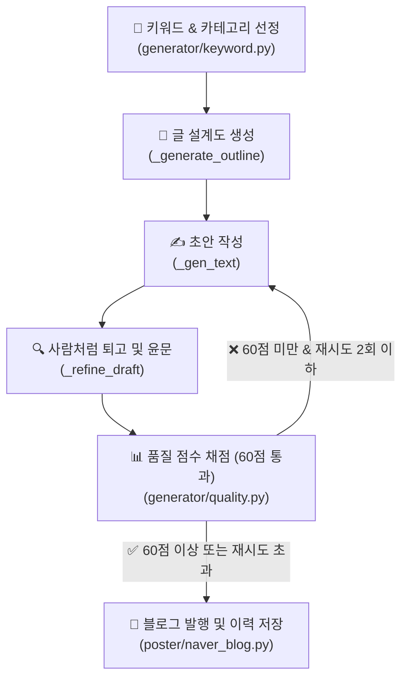

# 🎀 현지언니 블로그 글쓰기 체계 및 품질 고도화 가이드

본 문서는 네이버 블로그 **'현지언니(blog.naver.com/hyunji_unni)'**의 게시글 품질을 극대화하고, 네이버의 2026년형 검색 알고리즘(C-Rank 및 D.I.A.+)에 최적화된 글쓰기 체계를 확립하기 위한 통합 가이드라인입니다.

---

## 1. 글쓰기 & 품질 검증 자동화 파이프라인

현지언니 블로그의 콘텐츠 생성 및 발행은 다음과 같은 5단계 검증 프로세스를 거칩니다.



---

## 2. 현지언니 페르소나 (Persona)

> ★2026-06-30 피벗: 블로그를 **고CPC 정보성**(정부지원·건강·금융·세금·보험·부동산)으로 전환. 아래 **2-A(현행)**를 따른다. 살림 페르소나(2-B)는 추후 별도 살림 블로그용으로 보존.

### 2-A. 현행 페르소나 — 생활정보 언니 (고CPC 정보성)

| 항목 | 상세 설정 | 톤앤매너 반영 |
| :--- | :--- | :--- |
| **이름 / 나이** | 박현지 (현지언니) / 28세 | 친근한 20대 후반 언니 느낌 |
| **역할** | 놓치기 쉬운 **돈·혜택·건강 정보를 직접 발품 팔아 쉽게 정리**해주는 똑부러진 생활정보 큐레이터 | 정부지원·금융·세금·보험·부동산·건강을 쉽게 풀이 |
| **핵심 가치** | **정확·신뢰 최우선** (틀린 정보 금지, 불확실하면 "공식 확인 권장") | 정보성 글의 생명 = 정확성 + 최신성(2026 기준) |
| **경험성** | "제가 직접 알아보니", "저도 처음엔 헷갈렸는데" 1인칭 **자연스럽게만**(과하지 않게) | D.I.A.+ 경험성 점수 + 무미건조한 정보블로그와 차별화 |
| **말투/어조** | 친근한 구어체("~예요, ~더라고요")지만 **정확·차분**. 과한 감탄·이모지·살림주부 색채(다이소/집들이) 금지. ★**존댓말 종결 필수** — 반말 평서형(~했다/~이다) 종결 금지(§4-1 참고, quality.py 게이트로 차단) | 신뢰감 있는 정보 전달 |

> **한 줄 요약:** "신혼·사회초년생이 놓치기 쉬운 돈·혜택·건강 정보를, 직접 발품 팔아 정확하고 쉽게 정리해주는 똑부러진 28세 생활정보 언니"

### 2-B. 보관 페르소나 — 살림 주부 (추후 별도 살림 블로그용, 현행 미사용)

박현지(현지언니)/28세, 결혼 2년차 신혼주부, 경기 수원 24평, 다이소/이케아 가성비 살림 특기, "~했어요 ㅎㅎ" 구어체. "직접 겪은 실패담 털어놓으며 정보 떠먹여주는 똑부러진 신혼주부." → 살림/레시피/일상 카테고리 부활 시 사용.

---

## 3. 도입부 다변화 규칙 (천편일률적 시작 타파)

네이버 알고리즘은 **모든 글이 유사한 형식으로 시작하는 것**을 AI 생성 글의 가장 강력한 징후로 판단합니다. 따라서 아래의 **공식 도입부는 절대 사용하지 않습니다.**

### ❌ 절대 금지 도입부 패턴
* ~혹시 ~때문에 고민하고 계신가요?~
* ~솔직히 저도 처음에는 똑같은 고민을 했었는데요.~
* ~오늘은 제가 ~에 대한 꿀팁을 준비했습니다.~
* ~이 글 하나만 끝까지 읽으시면 더 이상 고민하지 않으셔도 돼요!~

### 5대 추천 도입부 스타일 (랜덤 강제 적용)
도입부는 매번 아래 중 하나의 방식으로 완전히 새롭게 시작해야 합니다.

1. **장면 및 시간 묘사 (스토리텔링)**
   * *예시:* "어제 저녁 8시 반쯤이었나, 싱크대 앞에서 양파 껍질을 까다가 문득 한숨이 푹 나오더라고요."
2. **구체적 수치 또는 사실 제시**
   * *예시:* "이거 2,000원짜리 하나 바꿨을 뿐인데, 매달 나가던 전기요금이 1만 4천원이나 줄었어요."
3. **솔직한 실패담 고백**
   * *예시:* "부끄럽지만 고백하자면... 저 이거 1년 동안 완전히 반대로 쓰고 있었던 거 있죠. 진짜 허탈하더라고요."
4. **역두괄식 결론 먼저 투척**
   * *예시:* "결론부터 털어놓을게요. 비싼 브랜드 다 필요 없고, 다이소 청소 코너 2천원짜리가 답이었습니다."
5. **일상 에피소드**
   * *예시:* "주말에 남편이 냉장고 열다가 '자기야, 이거 냄새 왜 이래?' 하는데 심장이 덜컥 내려앉더라고요."

---

## 4. AI 냄새 제거: 필터링 및 대체어 목록

글쓰기 인공지능이 자주 쓰는 교과서적인 표현이나 딱딱한 번역투는 읽는 이의 체류시간을 단축시키고 기계적인 느낌을 줍니다.

### 🚫 AI 상투어 및 교과서체 금지
* **교과서식 당부 금지:** `~하는 것이 중요합니다`, `~하시는 것이 좋습니다`, `~하시기 바랍니다`
  * ➔ *대체:* `~해보면 진짜 편해요`, `~하는 게 훨씬 낫더라고요`, `~하면 끝이에요!`
* **부자연스러운 권유 금지:** `~마련해 보세요`, `~선사합니다`, `추천드립니다`
  * ➔ *대체:* `한번 써보세요`, `완전 신세계예요 ㅎㅎ`, `이게 가성비 킹입니다`
* **광고성 수식어 금지:** `혁신적인`, `탁월한`, `최적의`, `최고의`, `필수적인`
  * ➔ *대체:* `진짜 편한`, `가성비 좋은`, `쓸만한`, `이거 하나면 끝나는`

### 🚫 금지 접속사 및 번역투
* **기계적인 접속사 금지:** `게다가`, `더욱이`, `또한`, `주목할 만한 것은`
  * ➔ *대체:* `근데요`, `그리고요`, `참고로`, `아 맞다`
* **명사형/동사형 번역투 금지:** `~를 통해`, `~함으로써`, `~함에 있어`, `~에 있어서`
  * ➔ *대체:* `~해서`, `~하니까`, `~해봤더니`
* **정형화된 순서어 금지:** `첫째, 둘째, 셋째, 마지막으로`
  * ➔ *대체:* `우선`, `그다음에는`, `아 참, 그리고`, `마지막 단계로`

### 🚫 요약형 마무리 금지
* **글의 마지막에 요약 금지:** `이상으로 ~에 대해 알아보았습니다. 도움이 되셨다면...`
  * ➔ *대체 (개인적 소감 + 향후 계획):* "아무튼 저는 이번에 정리 싹 하고 나니까 속이 다 시원해요. 다음 주말에는 냉장고 문 쪽 포켓도 털어볼 생각인데, 그것도 깔끔하게 성공하면 기록 남기러 올게요! 다들 기분 좋은 하루 보내세요 ~"

## 4-1. 반말 종결 금지 — 3겹 방어 (2026-07-27, 라이브 반말 혼입 실사고 반영)

> **실사고**: 존댓말 블로그 발행 글에 반말 문장("~까다롭다.", "~가능하다.")이 중간중간 혼입.
> 원인 = ①존댓말 강제가 프롬프트 지시 1겹뿐(생성 후 결정론 검수 전무) ②tech `_COMMON_RULES`의
> "'~습니다' 3연속 금지 + 짧은 단정 섞기" 지시가 반말 금지 규칙과 상충 → 문장 끊다가 반말로 이탈.

### 규칙
* **본문·FAQ·요약의 모든 문장은 존댓말(~요/~죠/~습니다/~세요/~는데요)로 종결한다.** 반말 평서형 종결(~했다/~이다/~있다/~없다/~된다/~같다/~야/~지/~해/~돼/~거든/~잖아/~더라 등) 금지.
* **허용 예외**: ①큰따옴표/작은따옴표 안 **인용문** ②**명사·체언 단독 종결**("총 600만원.") ③FAQ 단답 **"네." / "아닙니다."** ④불릿·체크리스트의 **명사형 종결**(§7 0-l 규칙 8과 정합).
* 문체 리듬(짧은 단정·질문·대비 섞기)은 유지하되 **존댓말 안에서만**: "가격이 문제죠." O / "가격이 문제다." X.

### 3겹 방어 구현
1. **프롬프트(1겹)**: `content.py` 페르소나(존댓말 필수 명시), `info_content.py` 페르소나(★존댓말 필수 블록), `tech_content.py` 문체 섞기 지시를 "짧은 단정문도 반드시 존댓말 종결"로 명확화(상충 해소).
2. **퇴고(2겹)**: `_REFINE_SYSTEM`·`_HEALTH_REFINE_SYSTEM`·`_GOV_REFINE_SYSTEM`(content.py)·`_INFO_REFINE_SYSTEM`(info_content.py) 전부에 "반말 종결 문장 → 존댓말 교정(인용문 제외)" 항목 추가.
3. **결정론 게이트(3겹, 핵심)**: `quality.py find_banmal_sentences()`/`banmal_gate()` — 고신뢰 반말 종결 패턴만 검출(오탐 방지 정밀도 우선: '~다' 종결은 '니다/마다/보다' 제외, '~지/~네/~어'는 용언 어간 한정, 인용문·마커 줄·표 행 제외). **1문장이라도 검출되면 불통과**:
   - `score_content`(daily/recipe)·`score_stock_content`(stock 전체): 감점(-15/문장, 최대 -30) + **critical → needs_retry 재생성**.
   - `generate_info_post`·`generate_gov_post`·`generate_tech_post`·`generate_tech_guide`·`generate_cheongyak_naver_post`·`generate_health_post`: 루프 안 하드 게이트 — 반말 검출 시 검출 문장을 피드백으로 되먹여 재생성(반말 초안은 best 폴백 후보로도 미보관). 퇴고본 채택 조건에도 동일 게이트.
   - 커버리지: **활성 발행 경로 전부**(info 4종·gov·stock·tech·tech_guide·cheongyak·보관 daily/recipe/health).

---

## 5. 포스팅 레이아웃 및 최적의 가독성 설계

모바일로 블로그를 읽는 독자 비율이 80%를 상회하므로, 철저히 모바일 뷰에 맞춰 레이아웃을 최적화합니다.

```
[사진1] (시각적 시선 유도)
도입부 단락 (2~3줄로 호흡 짧게)
[소제목] (이모지 없이 텍스트만 깔끔하게)
단락 1 (최대 2~3줄 이내 — 모바일 기준 엄수)
단락 2 (중요 단락 뒤 공백 라인)
[사진2] (텍스트 - 사진 - 텍스트 리듬 유지)
[표] (2열 권장: 항목 | 내용 형태 — 3열은 모바일 깨짐 주의)
[소제목] ...
```

* **한 단락의 최대 길이:** 한 단락은 **절대 2~3줄**을 넘기지 않습니다. (기존 4줄 → 강화) 모바일에서 글 덩어리는 즉시 이탈을 유발합니다.
* **이미지 마커 (`[사진N]`):** 텍스트 중간중간 시선 쉼터 역할을 하도록 텍스트-사진-텍스트 배치를 정밀히 지킵니다. (레시피글은 5개 고정)
* **네이버 표 활용 — 모바일 우선:** 3열 표는 모바일에서 가로 잘림 또는 글자 축소 현상 발생. **2열(항목|내용) 구조를 기본으로** 사용하고, 3열이 꼭 필요한 경우 열 내용을 짧게 유지. (※ SE ONE 제약으로 자동발행은 §6·§7 참고)

### 소제목 규칙 (2026-06-30 지시 반영)
* **번호 금지:** 소제목 텍스트 맨 앞에 번호(`1.`, `①` 등)를 붙이지 않는다. 본문 내용에도 번호(신청단계 ①②③, FAQ 등)가 있어 혼동됨. (나쁜 예: `5. 자주 묻는 질문` → 좋은 예: `자주 묻는 질문`)
* **★2026-07-28 예외(노매새드 4종 — 아래 전용 섹션 참고):** **info(금융·세금·보험·부동산)·gov 파이프라인의 본문 소제목 5개는 `01 `~`05 `(두 자리 숫자+공백, 점 없음) 번호를 붙인다.** 점 붙은 `N.` 형식·`①`은 여전히 금지(SE 오토포맷 "2. 2." 실사고·원형숫자 리스트 혼동 — 기존 금지 사유 유지). FAQ 소제목('자주 묻는 질문')과 그 외 파이프라인(주식·테크·청약·살림)은 기존 번호 금지 그대로.
* **회색바 + 볼드:** 소제목은 **회색 버티컬라인(인용구) + 볼드**로만 구분한다. 번호·이모지 불필요. (poster `_style_paragraphs(style_type="quotation_vertical", bold=True)` — 회색바 적용 후에도 볼드 적용되도록 수정함)
* **"함께 보면 좋은 글"도 소제목화:** 본문 끝 관련글 링크 섹션의 "함께 보면 좋은 글" 헤딩도 동일한 회색바 소제목으로 처리한다(좌측정렬, 중앙정렬 아님). 4개 스크립트 `_append_internal_links`가 이 헤딩을 subheadings로 반환.

### 글머리기호 내어쓰기 (2026-06-30 지시 — §7 #4에서 구현 추적)
* `·`, `①`, `✔` 등 글머리기호로 문장 시작 위치가 밀린 줄은, 줄바꿈 시 둘째 줄도 **첫 글자 위치에 맞춰 내어쓰기(hanging indent)** 한다. 글머리표 아래로 텍스트가 가지런히 정렬돼야 가독성이 유지됨.
* **✅ 2026-07-02 확장:** `①②③...⑩` 순번 줄도 네이티브 번호매기기(`decimal`) 리스트로 변환되어 동일하게 내어쓰기 적용됨(§7 "해결됨" 참고). 한 글 안에서 `· `/`①` 등 서로 다른 글머리기호가 섞여도 둘 다 네이티브 리스트로 렌더링되어 스타일이 통일됨.

### 인라인 강조(볼드) — 폐지 (2026-07-05)
* **인라인 볼드 기능 전면 폐지.** 본문에 `[[ ]]`·`**`·`__` 등 굵게 표시 마커를 쓰지 않는다. 중요 내용은 소제목·표·불릿·숫자로 드러낸다.
* **폐지 이유**: 인라인 볼드는 구현 방식 2가지가 모두 실사고를 냈다. ①후처리(`_apply_inline_emphasis`, 커서 이동+Shift+Delete)는 SE ONE 키 유실로 본문 글자 유실(§7 2026-07-05 Resolved). ②그 대안인 타이핑 시점 Ctrl+B 토글도, 마커가 단어 중간(예: `[[영향을 미]]치므로`)을 감쌀 때 **한글 조합+볼드토글 경계에서 글자가 중복 삽입**됨(`영향을 미 미치므로`, JEPI 실발행 224337094955에서 2건, 최종 HTML은 `se-weight-unset`이라 볼드도 안 남고 오타만 남음). **자동 발행이라 매 건 검수가 불가**하므로 강조 3개의 이득 < 오타 1건의 신뢰도 손상. → `_type_in_editor`가 `[[ ]]`를 텍스트로만 벗기고 볼드 안 함. 프롬프트(§stock 8번)는 마커 생성 자체를 금지. quality.py는 마커 있으면 소폭 감점(발행엔 무해하므로 재생성은 안 시킴).
* 🔜 굵게 강조가 꼭 필요하면, 발행 완료 후 특정 텍스트를 JS로 선택해 볼드 적용하는 별도 방식을 검토(타이핑 스트림과 분리 → 조합 경계 문제 없음). 우선순위 낮음.

### 인라인 강조(볼드) — 신규 (2026-07-02, ⚠️2026-07-05 폐지됨 — 위 항목 참고)
* 문장 전체가 아니라 **특정 키워드·숫자만** 볼드 처리하고 싶을 때 프롬프트에서 `[[강조할 짧은 구절]]` 마커를 사용한다(3~10자 내외).
* ⚠️ `**텍스트**`(마크다운 볼드)는 사용하지 않는다 — `generator/content.py`의 `_parse_response`가 기존 AI-티 제거 규칙으로 이미 벗겨낸다. 반드시 `[[ ]]` 사용.
* **글 전체 3~5개로 엄격 제한.** 지시를 느슨하게 주면(섹션당 1개 등) LLM이 수십 개를 남발하는 것을 실측으로 확인(2026-07-02, 80개 생성 사례) — "글 전체 몇 개"로 명확한 총량을 못박을 것.
* **금지 위치:** 표 안, `[사진N]` 마커 바로 앞의 요약·전환 문장. 그 문장은 이미지 삽입 앵커로 그대로 재사용되는데, 강조 마커가 있으면 앵커 계산 시점(원문 기준)과 실제 삽입 시점(마커 제거 후 편집기 텍스트) 텍스트가 달라져 앵커 매칭이 실패한다(§7 "[사진2] 앵커 충돌" 버그와 동일 원인).
* 구현(2026-07-05 전면 교체): `poster/naver_blog.py` `_type_in_editor`가 **타이핑 시점에 `[[kw]]`→Ctrl+B 토글**로 처리(기존 `**` 볼드 경로 재사용). 과거 후처리(`_apply_inline_emphasis` 커서 이동 방식)는 커서 어긋남으로 본문 문자 유실+마커 노출 실사고가 있어 폐기 — §7 Resolved(2026-07-05) 참고. 요약블록·FAQ·표 등 별도 타이핑 경로는 삽입 직전 마커 strip(볼드 포기, 노출 방지).

### 헤더 카드 텍스트 (2026-07-02 버그 수정)
* `create_health_header_card`는 이제 **`keyword`(짧고 간결한 훅) 인자를 우선 사용**한다. 과거엔 `title`에서 파생한 텍스트가 항상 우선이라 `keyword`가 사실상 무시되고, 헤더 카드 문구가 게시글 제목과 완전히 동일하게 나오는 버그가 있었다(4개 파이프라인 전체 영향: stock/health/gov/info).
* 헤더 카드는 **제목을 그대로 반복하지 말고**, 그 글의 핵심을 짧게 압축한 문구(호출 시 `keyword` 인자)로 채운다.
* 줄바꿈은 이제 **단어(공백) 단위**로 처리되어 `SCHD`·`ETF` 같은 영문 티커/약어가 줄 경계에서 잘리지 않는다(`_wrap_korean_text` 재작성, 공백 없는 긴 한글 덩어리만 글자 단위 폴백).

### 정보성(info) HTML 인포그래픽 헤더카드 — 개선 (2026-07-03)
* `poster/infographic_html.py`(`create_infographic_via_html`, info/gov/stock 3개 파이프라인 공통 — 실패 시에만 PIL `create_health_header_card`/`create_info_infographic` 폴백) 900×900 정방형, 3단제목+아이콘카드3~4개+CTA 구조.
* **사용자가 발행 직후 실물 확인하며 지적**: 빈 공간 과다, 아이콘카드 부실(2개만 채워짐), 썸네일로서 시선을 못 끔.
* **원인 3가지 수정**: ①`scripts/info_post.py`의 `_extract_summary_bullets`가 괄호 `(...)` 포함 줄을 통째로 스킵하던 과도한 필터 — 정상 부연설명 있는 불릿까지 날아가 카드 3개가 2개로 줄어듦. 괄호만 제거하고 본문은 보존하도록 수정 ②`.hero`(3단제목) 영역이 `flex:1`로 남는 공간을 전부 흡수 → 카테고리 아이콘(`icons[0]`)을 배경에 크고 흐리게(`opacity:.10`, `font-size:340px`) 배치해 시각적 공백 해소 ③카드 텍스트가 18자에서 단어경계 무시하고 잘려 "15%"→"15"처럼 의미가 바뀌던 문제 — 26자+단어경계+말줄임표(`_short_bullet`)로 교체.
* 로컬 Playwright(`pw.chromium.launch()`, GH Actions와 동일 번들 크로미움)로 세금절세·부동산주거 렌더링 시각 확인 완료.

### 인포그래픽 헤더카드 — 전면 레이아웃 재설계 (2026-07-03, 실물 스크린샷 피드백 반영)
* 사용자가 실제 발행된 SCHD ETF 카드를 보고 7가지 구체 지시. `poster/infographic_html.py` 전면 재작성:
  - 상단 배지("✓ 현지언니·ETF")·하단 CTA 바("핵심 ETF 확인하세요!") **완전 삭제**. CTA에 쓰던 카테고리 색을 **전체 테두리(16px solid border)**로 재활용 — 색은 그대로 유지하되 역할만 배지/CTA→프레임으로 전환.
  - 통계 카드 3~4개: 아이콘 원(`.bicon`)·"핵심 0N" 라벨(`.blabel`) **삭제**, 남은 텍스트(`.btext`)가 카드를 꽉 채우도록 26px·굵게·가운데정렬로 확대.
  - 제목: 3단(`.ts`/`.ta`/`.tb`, 작은글씨+포인트글씨+아래글씨) 구조를 **단일 줄 가운데정렬**로 통합, 위아래 여백 제거(`.hero`가 `flex:1`로 남는 공간을 상하 패딩 없이 흡수).
  - 캔버스를 정방형(900×900)에서 **가로형(1600×900)으로 변경**. 썸네일은 가운데 정사각형(900×900, x축 [350,1250])만 잘려 나오므로, 제목 폰트 크기 버킷(`_title_fontsize`, 글자수 기준 46~150px)을 이 크롭 영역 안에 항상 들어가도록 실측 렌더링(로컬 Playwright)으로 검증. 배경 장식 아이콘(`herobg`)은 크롭 영역 바깥 오른쪽에 배치해 전체보기에서만 보이는 보너스 요소로 활용.
  - 곁다리 버그: `display` 텍스트 22자 초과 시 기존엔 단어 중간에서 그냥 잘렸다("...총정" 같은 어색한 절단) → 단어경계+말줄임표(`…`)로 수정.
  - 로컬 Playwright로 짧은 제목(3자)~긴 제목(23자 초과 절단 케이스)까지 다수 카테고리 렌더링, 매 케이스 크롭 안전영역 내 수렴 확인.

### 인포그래픽 헤더카드 — CTR 리서치 반영 2종 (2026-07-03)
* 사용자 요청으로 블로그 썸네일 CTR 관련 외부 리서치(네이버 공식 가이드+유튜브 썸네일 심리학) 수행 후 실제 적용:
  - **브랜드 워터마크 복원**: 배지 삭제로 사라진 브랜드 인지 요소(리서치: 일관된 브랜딩이 재방문 CTR 15~20%↑)를 크롭 안전영역(가운데 900×900) **바깥** 좌상단 코너에 옅은(`opacity:.5`) "현지언니" 텍스트로 최소 복원. 썸네일엔 안 보이고 전체보기에서만 노출 — 가독성 훼손 없음.
  - **호기심형 카피 실험(카드 전용)**: `scripts/stock_post.py`에 `_card_hook_keyword()` 추가 — 단일종목/ETF 개별분석(`_etf_content_type`가 kr_individual/us_individual/kr_overseas_individual, 또는 종목분석)에 한해 50% 확률로 "OOO 지금 사도 될까?" 질문형으로 변형. 섹터비교·절세계좌·gov·info 등엔 미적용(어울리지 않음). **실제 게시글 제목·이미지 alt텍스트는 원래 팩트 문구 그대로 유지**하고 카드 표시 텍스트만 변형 — 클릭베이트 방지(본문이 실제로 그 질문에 답하므로 리서치가 경고한 "허위 후킹"에 해당 안 됨).
  - 아직 A/B 성과 비교는 안 함(네이버 통계 축적 필요) — 몇 주 뒤 카테고리별 클릭률/체류시간 확인 권장.

### 인포그래픽 헤더카드 — 썸네일 가독성 재설계 (2026-07-04, 샘플 승인 후 확정)
* 사용자가 샘플 비교 후 승인한 재설계를 `poster/infographic_html.py`에 반영:
  - **다크 그라디언트 배경 + 흰색 대형 타이틀**로 전환 — 밝은 배경 대비 썸네일 축소 시 가독성 대폭 개선.
  - 타이틀은 **최대 2줄, 실측 폭 기반 폰트 산정(72~170px)** — 글자수 버킷 대신 렌더링 폭을 측정해 크롭 안전영역에 항상 수렴.
  - 카드 텍스트는 **키워드만 ≤18자**로 압축(긴 문장형 불릿 제거).
  - 장식 요소는 **저투명도 배경**으로만 사용, 불릿(통계 카드)은 가운데 900×900 크롭 **바깥**에 배치해 썸네일에서는 타이틀만 보이도록 함.

### FAQ 표 형식 — 노매새드 벤치마킹 (2026-07-27 적용, 라이브 검증 대기)
* **스펙(대형 블로거 노매새드 분석 결과, 사용자 요청)**:
  - FAQ는 **1열 표(박스형)**: 첫 행(헤더) "자주묻는질문(FAQ)" 볼드+가운데 → 이후 각 Q행("Q. 질문", 볼드 시도)과 A행(답변) 교대.
  - **Q는 4~5개**, 독자가 실제 검색할 법한 질문. **답변은 "네." 또는 "아닙니다."로 시작하는 1~2문장 + 본문 핵심 숫자(금액·기간·비율) 1개 이상 포함.**
  - 위치: 마지막 본문 섹션 뒤, **결론(마무리) 직전** — 기존 FAQ 위치 그대로.
* **렌더 구현**(`poster/naver_blog.py _insert_faq_table`, 기존 표 삽입 코드 셀렉터·패턴 재사용):
  - SE ONE은 표 버튼 클릭 시 무조건 3×3 표 생성 + **열삭제 자동화는 best-effort**(§7 #1) → **셀을 채우기 전에** 빈 표 상태에서 `_delete_table_last_col` 2회로 3→1열 축소를 먼저 시도.
  - 축소 실패·행 확보 실패·셀 0채움이면 **Ctrl+Z로 빈 표를 되돌린 뒤**(표 수 검증 undo — 본문 과잉 undo 차단) 기존 인용구 방식(`_insert_faq_pairs`)으로 **폴백**. 반쪽 표·빈 3열 표가 발행본에 남지 않는 설계.
  - 셀 단위 볼드는 `_format_table_header`와 동일 패턴(셀 클릭→Ctrl+A→볼드 버튼/Ctrl+B) best-effort — 실패해도 "Q." 접두어로 구분 가능(스펙 허용).
* **생성기 반영**: `info_content._build_info_system`·`content._GOV_SYSTEM`의 FAQ 지시를 위 스펙(Q 4~5개, "네./아닙니다." 시작+숫자 포함, 짧고 완결된 1~2문장)으로 보강. 다른 파이프라인(stock·tech_guide·cheongyak)의 FAQ도 동일 표 렌더 경로를 타며, 생성 스펙은 각 파이프라인 특성 유지.
* 🔜 다음 info/gov 정기 크론 발행에서 라이브 확인: 1열 표 렌더·헤더행 서식·열삭제 성공률(실패 시 인용구 폴백 로그 "FAQ 표 삽입 실패 → 인용구 폴백" 확인).

### 정보성(info·gov) 노매새드 벤치마킹 4종 — 소제목 번호·서론 훅·표 구성·문장 리듬 (2026-07-28 적용, 라이브 검증 대기)
* **대상**: 활성 5카테고리만 — info 4종(`info_content._build_info_system`+`generate_info_post` 루프)·gov(`content._GOV_SYSTEM`/`_GOV_REFINE_SYSTEM`+`generate_gov_post`). 살림·레시피·health(보관)·주식·테크·청약은 미적용. 결정론 게이트 = **`quality.find_nomad_structure_issues`**(생성 루프 재생성 피드백 + 퇴고 채택 조건, info·gov 공용).
* **① 소제목 01~05**: 본문 5개 섹션 소제목이 `01 `~`05 `로 시작(점 없음), FAQ는 번호 없음. **02·03·04를 템플릿상 질문형으로 고정해 '질문형 3개 이상'이 결정론 보장**(`02 …나도 되나?`/`03 얼마나 …까?`/`04 꼭 알아둘 점 — 뭘 조심해야 할까?`). gov는 **`03 얼마나 받을 수 있을까?` 시나리오 계산 섹션을 신설**해 info와 같은 '5본문+FAQ' 구조로 통일(소제목 5→6개, REFINE·체크리스트 동기화).
* **② 서론 훅 3종 로테이션**: a따옴표 질문 / b페르소나 시나리오 / c숫자 경험 — **직전 발행과 다른 유형 강제**(a→b→c). 선택 로직 `quality.pick_intro_hook`/성공 시 `record_intro_hook`, 상태 파일 `data/info_hook_history.json`(★info 워크플로의 `git add data/info_*_history.json` 글롭에 걸리도록 이 이름 — gov 워크플로는 이 파일을 커밋하지 않아 **gov는 날짜 기반 결정론 폴백이 실질 로테이션**, 연속 실행일마다 훅이 달라짐). 서론 구조: 5~7문장(1문장=1문단)·250자 이내, 4문장 안 **"결론부터 말하면 ~입니다. 다만 ~"**, 끝 문장 **"~정리해보겠습니다."**. 기존 '도입부 정확히 2줄' 규칙은 이 구조로 **대체**(REFINE의 '2줄 압축' 지시도 교체 — 퇴고가 서론을 뭉개지 않도록 보존 목록에 명시).
* **③ 표 구성(원지시 '표 3종' → 실구현 2표+1줄)**: ①01 섹션 **2열 요약표** `구분|내용`(구분 8자·내용 20자 이내) ②03 섹션 **3열 시나리오 계산표** `구분|계산|결과`(특정 금액 가정 1문장을 표 위에, 계산 과정 서술 1~2문장을 표 아래에, 셀 12자) ③전문용어 첫 등장 직후 정의는 **1행 표 대신 단독 줄 `❓ 용어: 한 줄 정의`**(글당 1~2개). **1행 표 미적용 사유**: SE ONE은 표 버튼 클릭 시 무조건 3×3 생성 + poster에 **행 삭제 자동화가 없음**(열삭제만 best-effort) → 1행 표는 빈 2행이 발행본에 잔존하는데 poster 수정 금지 제약으로 해소 불가. 2열 요약표는 기존 `_insert_table`의 '채움 후 초과 열삭제 best-effort'(07-16 검증 로직) 경로 사용 — **실패 시 빈 3열 잔존 리스크는 라이브 확인 항목**(§6의 '2열 깨짐' 경고는 열삭제 구현 전 결론). gov의 '여러 대상×값 표 승격' 지시는 표 2개 고정과 충돌해 제거(불릿 유지). 계산 시그널 게이트(`_GOV_CALC_SIGNAL_RE`)는 표 전체(`table_strs`) 합산 검사로 확장.
* **④ 문장 리듬·결론 체인**: 1문장=1문단(최대 2문장)·평균 40자(최대 70자)·'~합니다'+'~요/~죠' 혼합·4~5문장마다 짧은 존댓말 단정문(반말 금지는 §4-1 그대로 — 게이트 공존 확인) · **"저라면 ~" 2회 이상** / 마무리 = **"결국 ~" 결론 → 핵심 숫자 재강조 → '오늘 할 일' 1문장 → "A → B → C" 확인 체인 한 줄**. gov 규칙 7(페르소나·감정 금지)은 '서론 훅·저라면 등 지정 위치 1인칭 허용'으로 완화. **숫자 볼드는 미적용** — 인라인 볼드 전면 폐지(§5 2026-07-05, 글자 중복·유실 실사고 2건)로 기존 볼드 메커니즘이 없음(`**`·`[[ ]]` 모두 금지·strip).
* **실측 검증(2026-07-28, 발행 없이 generate_info_post만)**: 세금절세 '월세 세액공제 조건' — 게이트 피드백 재생성 3회 후 통과. 소제목 6(01~05+FAQ, 질문형 3) · 표 2(2열 5행 요약 + 3열 4행 계산) · 서론 5문단 247자(훅 c·'결론부터 말하면'·'정리해보겠습니다') · '저라면' 2회 · '결국'+확인 체인 · ❓용어 줄 1 · FAQ 4쌍('네./아닙니다.' 시작 3/4) · 반말 0건 · prose 2,283자.

---

## 6. 모바일 가독성 원칙 (2026-06-29 리서치 기반)

> 이 섹션은 프롬프트 수정의 근거 문서입니다. 글쓰기 방향을 변경할 때 반드시 이 원칙과 충돌하지 않는지 확인하세요.

### 독자 행동 패턴 (Nielsen Norman Group 연구)

사람들은 글을 "읽지" 않고 **"스캔"** 합니다.
- **F패턴**: 첫 줄 → 좌측 세로 훑기 → 소제목만 읽기
- **레이어케이크 패턴**: 소제목 → 첫 문장만 확인하고 넘어감
- **모바일 마킹 패턴**: 손가락으로 스크롤하면서 한 줄씩 고정 → 긴 단락은 그냥 넘어감

**결론**: 소제목, 첫 문장, 불렛 3개가 전부. 나머지는 읽지 않는다고 가정하고 써야 함.

### 최적 글자수 기준

| 항목 | 기준 | 근거 |
|---|---|---|
| 네이버 블로그 최적 글자수 | **1,000~2,000자** | pagewriter.kr 실측 데이터 |
| 한 문장 권장 길이 | **50자 내외** | 모바일 한 줄 = 30~50자 |
| 단락 권장 길이 | **2~3줄 (50~100단어)** | UXPin/Baymard 연구 |
| 단락 최대 | 150단어 초과 시 "덩어리감" 이탈 | Baymard 연구 |
| 이탈률 절반 조건 | 결론을 첫 3문단 안에 배치 | legalmarketing.kr 실험 |

### 카테고리별 권장 글자수 (현재 → 목표)

| 카테고리 | 현재 요구 | 목표 | 이유 |
|---|---|---|---|
| 정부지원 | 4,000자 이상 | 2,000~2,500자 | 표+FAQ 구조로 핵심 전달 충분 |
| 건강글 | 1,500자 이상 | 1,200~1,800자 | 항목별 불렛이 길이 대체 |
| 레시피 | 1,200자 이상 | 유지 | 단계 설명은 길이 필요 |
| 살림/일상 | 2,500자 이상 | 1,500~2,000자 | 체험담 압축 집중 |

### 표 형식 원칙

**3열 표 문제**: 모바일 화면 폭 초과 → 가로 스크롤 or 글자 자동 축소 → 읽기 포기

```
❌ 3열 (모바일 깨짐)          ✅ 2열 (모바일 OK)
구분 | 조건 | 비고      →     항목      | 내용
나이 | 39세 이하 | ~    →     신청 나이  | 만 39세 이하
소득 | 100% | ~        →     소득 기준  | 중위소득 100% 이하
```

- **기본**: 2열(항목|내용) 사용
- **예외**: 비교가 꼭 필요한 경우 3열 허용하되 각 셀 내용 10자 이내로 압축
- **⚠️ SE ONE 제약(2026-06-30)**: 네이버 에디터는 표를 무조건 3열로 생성하고 **열 삭제 자동화가 불가**(§7 #1). 따라서 "2열 표"는 자동 발행에서 빈 3번째 열로 깨진다. → **표는 처음부터 의미 있는 3열로 설계**(각 셀 ≤10자, 빈칸 금지)하거나, key-value 정보는 표 대신 요약블록·· 불릿으로 렌더.
- **정부지원 표(현행)**: **딱 1개, 3열(구분|대상|지원금액)**. 핵심요약·자격은 표 대신 [요약블록]·· 불릿이 대체(중복 제거). content.py `_GOV_SYSTEM` 반영됨.

### 소제목 작성 원칙

독자가 소제목만 스캔해도 글의 핵심을 파악할 수 있어야 함.

```
❌ 나쁜 예: [소제목] 신청 방법
✅ 좋은 예: [소제목] 신청은 복지로에서 5분이면 끝
```

- 소제목은 **결론/수치 포함** 권장
- 소제목만 읽어도 "이 글에서 무엇을 얻을 수 있는지" 전달돼야 함

### 2026 네이버 알고리즘 주의사항

- AI 자동 생성 글 검색 배제 강화 (2025년 3월 개편, 지속 강화 중)
- 경험 기반 콘텐츠(직접 사용 후기, 구체적 수치) 우선 노출
- 체류시간보다 **"진짜 읽힌 깊이"** 측정 방향으로 전환 중
- 글자수 늘리기보다 **정보 밀도**가 핵심

---

## 7. 미해결 검토사항 / 작업 로그 (Issue Tracker)

> 글쓰기 방식에 대한 새 지시·검토사항·미해결 이슈는 모두 여기에 누적한다. 작업 시작 전 이 섹션을 확인해 중복·역행 작업을 방지한다.

### 🔴 미해결 (Open)

0-y. **★'쉽게보는 요즘경제' = 서사형 코너로 전환, 현지언니 페르소나 미적용 (2026-07-31 사용자 지시)**
   - **배경**: 첫 발행글(224363841201, 메르 「서킷브레이커와 국민연금 근황」 소싱)을 보고 사용자 평가 — "소재만 빌려왔다기엔 현지언니 스타일과 다르고, 글을 가져왔다기엔 내용이 너무 다르다. **'서킷브레이커'라는 주제만 가져온 것 같다.**"
   - **원본이 좋았던 이유(사용자 분석)**: 1987년 서킷브레이커 탄생 → 한국 도입 시기 → 첫 발동부터 몇 차례 큰 사건 → 국민연금의 대응 → 2026년 현재를 **시간순 서사로 풀어간다**. "독자들이 **어떻게 읽느냐**가 중요한데 **몰입감**이 월등히 뛰어나다."
   - **실측 대조(2026-07-31)**: 원본 2,233자·117줄·**평균 17자/줄**·최장 87자 ↔ 발행본 2,673자·48줄·**평균 53자/줄**·최장 241자. **몰입감 차이의 실체는 호흡(문장 길이)이었다.**
   - **결정**: **실험 카테고리에는 현지언니 페르소나를 적용하지 않는다.** 이 코너의 상품은 '정확한 정보 정리'가 아니라 '끝까지 읽히는 글'이다.
   - **적용(`generator/econ_digest.py`)**:
     · 문체 — 담백한 서술체(`~다/~였다`). 인사말·자기소개·'~해 드릴게요' 전면 금지.
     · **한 줄에 한 문장, 평균 15~25자, 60자 넘으면 끊는다.**
     · 첫 줄은 날짜·장면으로 연다("1987년 10월 19일은 월요일이었다"). 요약·인사로 시작 금지.
     · 구조 — 시간순(기원 → 도입 → 첫 사건 → 되풀이 → 지금). **'결론부터 말하면' 두괄식 금지**.
     · 소제목 0~2개(흐름 우선), **`❓ 용어` 정의 줄 폐지**(문장 안에서 풀 것).
     · 어려운 개념은 일상 사물 비유 1~2개(원본의 '두꺼비집'이 좋은 예).
   - **게이트**: `rhythm_issues()` 신설 — 줄 평균 38자 초과 / 90자 초과 줄 / 페르소나 인사말 / '결론부터 말하면' / ❓줄 / 첫 줄이 장면·날짜가 아님을 잡아 재생성 피드백. 3회 미달 시엔 표절 통과본으로 발행(발행 0건보다 낫다).
   - **표절 게이트·수치 규칙은 그대로 유지** — 이 트랙의 존재 조건이다.
   - 🔜 다음 발행글에서 호흡·몰입감 실물 확인. 필요 시 문장 길이 임계(38자) 재조정.

0-z. **🐛 요즘경제 본문에 `TITLE:`·`TAGS:` 헤더 노출 (2026-07-31 발견·수정)**
   - 첫 발행글(224363841201) 본문 맨 위에 `TITLE: …`, `TAGS: …` 두 줄이 그대로 찍혔다.
   - 원인: `body = txt.split("---", 1)[-1]` — 모델이 `---` 구분선을 빼먹으면 split이 원문 전체를 돌려준다. 헤더 파싱은 정규식으로 따로 하므로 눈치채지 못했다.
   - 수정: 본문에서 `^\s*(TITLE|TAGS)\s*:` 줄을 제거하는 방어를 추가.
   - 🔜 **이미 발행된 224363841201은 헤더 노출 상태** — 재발행 또는 수정 필요.

0-u. **★카테고리에 안 맞는 글 발행 — 키워드 매핑 조용한 폴백 (2026-07-31, 원인 수정 완료 / 발행글 처리 대기)**
   - **사용자 제보**: "습기제거·곰팡이 예방이 무슨 재테크야", "베란다 청소가 무슨 세금·절세야", "기존 틀에 억지로 맞춰 끼워넣으니 글이 이상해져 — 핵심 금리 혜택이 왜 들어가고 가입대상 조건이 왜 필요해".
   - **근본원인**: 카테고리명을 쉼표→가운뎃점으로 리네임(`e47cbb3`)했는데 `generator/keyword.py`의 매핑 표만 옛 이름(`"금융, 재테크"`)을 키로 남겼다. 조회 실패 시 `mapping.get(blog_category, ["청소정리"])`가 **조용히 살림 청소 풀로 폴백** → 거기에 월별 시즌 키워드(7월=여름 습기·곰팡이)까지 더해진 뒤, 고CPC 정보성 템플릿(금리·가입대상·신청방법·최신기준)이 그대로 씌워졌다. **5개 중 4개 카테고리가 오작동**(`보험`만 이름에 구분자가 없어 무사).
   - **피해**: 발행 4건. 그중 2건은 **없는 제도를 지어냄** — `베란다 청소, 최대 3,600만원 경비 처리로 세금 아끼는 법`(224362893096), `주방 기름때 제거 | 살림 지원금 최대 50만원 받는 조건`(224362677075). 나머지 2건은 습기·곰팡이 글(224363018021·224363319740).
   - **수정(`c679568` + 후속)**: ①매핑 키를 현행 가운뎃점 이름으로 교체 + 구분자(쉼표·가운뎃점·공백) 정규화로 흡수 ②**조용한 폴백 제거 — 미등록이면 `ValueError`**(엉뚱한 글을 내보내느니 슬롯을 거른다) ③`info_post`에 **카테고리 정합 가드**(선정 키워드가 그 카테고리 풀 소속이 아니면 발행 중단) ④회귀 테스트 `scratch/test_category_keyword_map.py` 6종.
   - **원칙(사용자 지시로 확립)**: **카테고리와 주제가 어긋나면 발행하지 않는다.** 템플릿을 억지로 씌워 글을 만들어내는 것보다 그 슬롯을 비우는 편이 낫다. 매핑·정합 판정은 실패 시 **조용히 넘어가지 말고 끊을 것**.
   - 🔜 **처리 대기**: 위 4건 삭제(허위 제도 2건 우선) — 프록시 없는 PC에서 `scripts/delete_posts.py`.

0-v. **★중복 발행 24건 — 교차 카테고리 미탐지 (2026-07-31, 원인 수정 완료 / 발행글 처리 대기)**
   - 전수 점검(고CPC 5개 카테고리 발행 158건) 결과 같은 키워드 재발행 **24건**. 간격이 1~4일로 30일 회피가 뚫려 있었다. 원인 3가지:
     ①DataLab 트렌딩이 같은 고검색량 키워드를 반복 반환(7/4~7/6, `exclude` 도입으로 기수정)
     ②**이력 커밋 유실**(7/18~7/29, `git add` 회귀 — 이력이 push 안 되면 다음 런이 스테일 이력으로 판단, 07-29 개별 add로 기수정)
     ③**중복 검사가 자기 카테고리 이력 파일만 봄 → 교차 카테고리 중복 미탐지**(미수정이었음). `여름 집 습기 관리` 7/30 부동산·주거 → 7/31 금융·재테크, `자녀장려금` 정부지원→세금·절세 2회.
   - **수정**: `generator.keyword.recent_keywords_all_tracks()` 신설 — `data/info_*_history.json` + `gov_history.json`을 합쳐 블로그 단위로 중복을 판정한다. `info_post`·`gov_post`가 자기 이력과 합집합으로 사용. **독자와 검색엔진에는 한 블로그이므로 중복 판정도 블로그 단위여야 한다.**
   - 🔜 **처리 대기**: 중복 24건은 최신 1건만 남기고 정리 검토(네이버 유사문서 스팸 리스크 — §10-3).

0-x. **🔴 발행글 전수 점검 결과 — 132건 중 104건에서 오류 확인 (2026-07-31, 조치 대기)**
   - 전체 상세 = **`docs/AUDIT_2026-07-31.md`**. 18개 에이전트가 본문 전량을 읽고 판정, 제기 188건을 반증 검증해 185건 확정(탈락 3).
   - 심각도 critical 3 / high 90 / medium 78 / low 14. 유형 본문오류 83 / 옛날제도 60 / 제도혼용 22 / 허위내용 20.
   - **A 삭제 권고 5건** — 글의 주제 자체가 종료된 제도라 수치 수정으로 복구 불가: 청년희망적금(2024 만기 종료)·신혼부부 취득세 감면(2020 일몰)·청년도약계좌(2025-12-31 신규종료)·4세대 실손 전환(2026-05 5세대 출시로 종료)·주택청약통장 월 10만원(납입인정 25만원 상향으로 전제 무효).
   - **B 수정 63건 / C 경미 36건**.
   - **★반복 오류가 핵심** — 같은 사실이 여러 글에서 동시에 틀린다: 기준 중위소득 연도 드리프트 11건, 청년도약계좌 종료 7건, 청년희망적금 종료 4건, 예금자보호 한도 5천만→1억(2025-09-01) 3건, 연금저축·IRP 한도 혼용 3건.
   - **결론**: 글을 한 건씩 고치는 방식으로는 못 따라간다. LLM이 학습 시점의 옛 수치를 계속 재생산하므로, **연 1회 이상 바뀌는 핵심 수치를 고정 사실 테이블로 주입**(gov의 `FORCE_FACTS` 확장)하고 생성 시 그 값만 쓰게 강제해야 한다. 0-w와 같은 뿌리.

0-w. **🔴 같은 제도인데 글마다 숫자가 다름 (2026-07-31 발견, 미해결)**
   - 중복 발행 점검 중 드러남. 같은 키워드로 쓴 글들의 제목 숫자가 서로 다르다.
     · 연금저축 세액공제: **1,200만원 → 900만원 → 99만원 → 99만원**
     · 연말정산 환급: **700만원 → 170만원 → 170만원**
     · 사업자 경비 처리: **1천만원 → 700만원**
     · 주택임대소득: **100만원 이상 → 2천만원 이하 14%**
   - **납입한도와 환급액을 섞어 쓴 것으로 보인다**(연금저축 납입한도 600만원·IRP 합산 900만원 vs 세액공제 환급액 약 99만원). 어느 쪽이든 **같은 제도를 두고 제목 숫자가 4배 넘게 흔들리는 건 '정확·신뢰'(§2-A) 정면 위반**이다.
   - 🔜 제목 숫자의 근거를 본문 표와 대조하는 게이트 필요. 현 `quality.py`는 숫자 **밀도**만 보고 **정합성**은 안 본다. gov의 `FORCE_FACTS` 주입(§7-h)처럼 핵심 수치를 고정 사실로 넣는 방식 검토.

0-t. **심층 가이드(tech_guide) 구조 전면 수리 — 목차·FAQ 위치·소제목 번호·리스트 계층 (2026-07-29 적용, 라이브 확인 대기)**
   - **배경(라이브 실사고)**: 첫 발행 2건(hyungsutech 224360142080·224360032924)에서 ①목차 서식이 일부만 볼드·크게 + 목차 항목이 실제 소제목과 불일치 ②FAQ가 글 상단(목차 직후)에 삽입 ③소제목에 ①②③ 번호 ④본문 번호가 "1. …설명… 1. 2."로 재시작 + 소제목급 문구가 평문단 노출. 사용자 "최악" 피드백, 해당 글 2건 삭제. **크론(`.github/workflows/tech_guide_post.yml`)은 정지 상태 유지 — 사람이 실물 확인 후 재개 결정.**
   - **근본원인(공통 뿌리 하나)**: poster `_style_paragraphs`/앵커 계산이 **'단락 텍스트 완전일치 첫 매치'** 방식인데, 목차 항목 텍스트가 소제목·FAQ 헤딩과 **글자까지 동일**해 첫 매치를 목차가 가로챘다. 게다가 `_convert_bullets_to_list`가 **소제목 스타일링 뒤·FAQ/표 삽입 앞**에 실행돼 목차의 `· ` 글머리가 제거되면서, FAQ 삽입 시점엔 목차 항목이 "자주 묻는 질문"과 완전일치 → FAQ가 글 상단으로 끌려감. 구 프롬프트가 소제목에 ①②③④를 직접 박아 넣은 것도 이 충돌을 키웠다. 번호 재시작은 §7 0-r과 동일 계열(비인접 번호 항목이 항목마다 `<ol>` 재시작).
   - **수정(전부 `generator/tech_guide_content.py`, poster 무수정)**: `_finalize_guide_structure` 파이프라인 신설 — ①`_ensure_header_marker`(최상단 `[사진1]` 1개 보장) ②`_strip_heading_numbers`(소제목 줄 번호 결정론 제거) ③`_normalize_step_numbers`(`^N.`/`N)`/전각 → 원형숫자 리터럴, **소수점 `1.5배`·21 이상 제외**) ④`_promote_orphan_subheads`(평문 노출 소제목급 줄을 `[소제목]`으로 승격 — 한 줄·4~25자·한글 2자+·종결어미 없음·앞뒤 산문일 때만, 명령어/경로 줄 보호) ⑤`_sync_subheadings`(**subheadings를 본문 `[구분선]` 직후 줄에서 재수집** → 목차·스타일링 대상이 실제 소제목과 구조적으로 불일치 불가) ⑥`_rebuild_toc`(모델 목차 폐기 후 실제 소제목으로 재구성, 각 항목 `· ` 접두 + **`자주 묻는 질문`은 목차에서 제외** = 위 배선 사고 차단) ⑦`_relocate_tables`(표를 소제목 바로 아래 → 섹션 첫 산문 뒤로).
   - **★부수 발견(중요)**: `content._parse_response`의 `N.`→원형숫자 치환이 `^\s*`라 **MULTILINE에서 앞의 빈 줄까지 삼켜** 번호 줄이 직전 문단에 달라붙는다(모바일 벽글 유발). 공용 파일이라 손대지 않고, 가이드 트랙은 `_pre_normalize_raw`가 **파싱 전에 줄 단위로** 먼저 ①로 바꿔 해당 치환이 아무것도 못 잡게 우회했다. 🔜 **다른 트랙(info·gov·stock·청약)도 같은 빈 줄 유실이 있으므로 별도 점검·수정 필요.**
   - **프롬프트 재정의(구조)**: 도입(문제 공감+이 글에서 얻는 것) → 요약블록 → **본문 소제목 3~5개(번호 없음, 단계는 ①②③ 리터럴)** → 실전 체크리스트 → 자주 묻는 질문 → 마무리. **목차·[구분선]은 모델이 쓰지 않는다(시스템이 결정론 생성)**. `[[미니 소제목]]` 마커 폐지(소구분도 `[소제목]`).
   - **게이트**: `_structure_issues` — 모델 품질(FAQ 존재/FAQ가 마지막 섹션 뒤/FAQ 뒤 마무리 존재/본문 소제목 4개+) + finalize 불변식(소제목 번호 0·본문 `N.` 줄 0·목차==소제목) 위반 시 재생성 피드백.
   - **검증(2026-07-29, 발행 없음)**: ast+import / 결함 5종 재현 fixture 5/5 통과 / 단위(표 이동, 승격 오탐 방어 8케이스 — `sfc /scannow`·경로·짧은 문장·불릿·①줄 전부 보존, 번호 변형 7케이스) / **실생성 1회**(`disk-100` 디스크 사용량 100%, 재생성 0회로 게이트 1발 통과): 목차 6항목 == 본문 소제목 6개 **완전일치**, FAQ 위치 3585 > 마지막 구분선 3569(마무리 직전), 소제목 번호 0건, 본문 `N.` 시작 줄 0건, 반말 0건(`find_banmal_sentences`), prose 3,731자·FAQ 3쌍·소제목 8(목차+본문6+FAQ).
   - 🔜 **재개 전 라이브 확인 항목**: ①목차 6항목이 전부 동일 서식(네이티브 글머리표)으로 렌더되고 소제목만 회색바+볼드인지 ②FAQ 인용구가 마지막 섹션 뒤·마무리 직전에 있는지(`NAVER_FAQ_TABLE` 기본 OFF라 인용구 경로) ③단계 ①②③ 리터럴 순번 보존·`<ol>` 0개(0-r 회귀) ④헤더 카드가 최상단에 삽입되는지(**실생성에서 모델이 `[사진1]`을 실제로 누락 → 결정론 보정 추가함**) ⑤`_promote_orphan_subheads` 오탐(엉뚱한 줄이 소제목·목차에 등장) ⑥소제목 텍스트가 중복될 때 목차엔 1개만 남고 둘째 소제목이 미스타일로 남는지.

0-q. **노매새드 벤치마킹 4종 — 소제목 01~05·서론 훅 로테이션·표 구성·문장 리듬 (2026-07-28 적용, 라이브 검증 대기)**
   - **적용(활성 5카테고리: info 4종+gov — 상세 스펙·미적용 사유 = §5 '노매새드 벤치마킹 4종')**:
     ①본문 소제목 5개 `01 `~`05 `+질문형 3개 이상(02·03·04 템플릿 고정으로 결정론 보장, gov는
     `03 얼마나 받을 수 있을까?` 섹션 신설) ②서론 훅 3종(a따옴표 질문/b페르소나/c숫자 경험) 로테이션
     — `quality.pick_intro_hook`+`data/info_hook_history.json`(gov는 날짜 폴백), 서론 5~7문장·250자·
     '결론부터 말하면 ~입니다. 다만 ~'·'~정리해보겠습니다.' ③표 2개(01 섹션 2열 요약표 + 03 섹션
     3열 시나리오 계산표) + `❓ 용어: 한 줄 정의` 단독 줄(**1행 표는 SE ONE 행삭제 자동화 부재로
     빈 행 잔존 → 미적용, poster 동결 제약**) ④1문장=1문단·평균 40자·'저라면' 2회+·마무리
     '결국 ~'→숫자 재강조→오늘 할 일→'A → B → C' 확인 체인. **숫자 볼드 미적용**(인라인 볼드
     폐지 2026-07-05 유지).
   - **게이트**: `quality.find_nomad_structure_issues` 신설 — 생성 루프 재생성 피드백(위반 목록
     통짜 되먹임)+퇴고 채택 조건(info·gov 공용). 기존 반말 게이트(§4-1)·FAQ 표 스펙(0-p)과 공존
     확인(신규 상투구 '정리해보겠습니다'·'결론부터 말하면'·확인 체인 줄 = 반말 게이트 오탐 0 검증).
   - **검증**: py_compile+import, 프롬프트 조립 12케이스(4카테고리×주제유형 3변형 — 01~05·질문형
     3+ 결정론 확인), 게이트 단위 4케이스, 훅 로테이션(c→a→b)·날짜 폴백 결정론, **실생성 1회**
     (세금절세 '월세 세액공제', 발행 없음): 게이트 재생성 3회 후 통과 — 소제목 6(질문형 3)·표 2
     (2열 5행+3열 4행)·서론 5문단 247자·저라면 2·결국+체인·❓ 1·FAQ 4쌍·반말 0·prose 2,283자.
   - 🔜 **라이브 확인 항목**: ①2열 요약표 열삭제 성공률(실패 시 빈 3열 잔존 — 로그 '초과 열 1개
     삭제 시도' 추적, 반복 실패면 요약표 3열 회귀 검토) ②`01 ` 소제목이 SE 오토포맷·리스트 변환에
     안 걸리는지(점 없는 두 자리라 이론상 안전) ③`❓` 이모지 타이핑 정상 렌더 ④노매새드 게이트
     재생성 빈도(재시도 소진 잦으면 게이트 완화) ⑤gov 훅이 실행일마다 달라지는지 ⑥서론 250자
     초과 빈도(현재 소프트 — 초과 잦으면 게이트 추가).

0-r. **번호 리스트 "1. 1. 1." 분절 — ✅근본해결 (2026-07-28, 224359666341 아님·224359504392 임대차 특약 모바일 HTML 실측)**
   - 증상: 본문 `<ol>` 3개가 전부 1항목짜리로 각각 "1."부터 재시작(불릿 `<ul>`은 정상 병합).
   - 근본원인: SE ONE ul/ol 비대칭이 아니라 **콘텐츠 형태 비대칭** — 모델이 번호 항목 사이에 설명
     문단을 끼움(① 항목/설명/② 항목/…) → 비인접 단락이라 SE의 인접 동종 리스트 병합 불가, 항목별
     `<ol>`이 각각 1부터 재시작(순번 담은 ① 리터럴은 변환 시 삭제됨). 그룹핑 수선은 산문을 리스트로
     삼키는 본문 훼손이라 구조적으로 불가.
   - 수정: `poster/naver_blog.py` `_native_list_type_of` 신설 — 원형숫자(①~⑳) 줄은 native decimal
     변환을 전면 스킵하고 리터럴 그대로 발행(순번 자체 보존, 내어쓰기만 포기). 불릿(`· `/`• `) 경로
     무변경. 생성기 "N. "→① 정규화(2026-07-06 오토포맷 방어)는 유지 — 종착지가 리터럴 발행으로 변경.
     §5 "① 줄도 decimal 변환" 항목은 이 결정으로 폐기. 단위 검증 14케이스+사고 글 재현 시뮬 통과.
   - ★교훈: 번호 리스트는 항목 비인접이 기본 형태라 native 변환이 구조적으로 위험 — 순번은 리터럴로
     보존이 항상 안전. 🔜 다음 번호 포함 글: `<ol>` 0개 + ①②③ 리터럴 순서·불릿 병합 회귀·긴 번호 줄
     모바일 줄바꿈 외관 확인.

0-s. **청약글 심화 — 입지·적정가·도면 (2026-07-28 적용·검증 완료, 라이브 확인 대기)**
   - ①`cheongyak_naver_content._research_location_brief` — 입지(교통·학군·인프라·호재)·인근 시세를
     검색 그라운딩으로 조사해 facts 주입, 브리프 있을 때만 ⑤-2 입지 섹션([[교통]] 등 4라벨, 호재 단계
     격상 금지). 실패 시 섹션 자연 생략(글 실패 없음). ②⑥ 가격 섹션 적정가 소결론 의무([적정/다소
     높음/판단 유보]+근거 {{ }} 강조) ③면책 2문장 의무 ④`pdf_capture_key_pages` 도면류 확장
     (`_SITE_KW_LABELS` 배치도/조감도/투시도/위치도, max_site=2, 텍스트 희박 잣대) — 네이버: 배치도·
     조감도→단지 소개 끝, 위치도→입지 섹션 끝 / WP: site 버킷→① 섹션 끝. **스캔 상한 60p→120p**
     (이천 휴먼빌 위치도 p.63 미스 실측 반영).
   - 실측: 최근 30일 공고 15건 중 도면 보유 1건뿐(캡처 0장이 정답인 공고가 대부분, 오탐 0), 더샵
     트리센트 실생성 검증(입지 섹션·소결론·반말 0·면책 2문장·앵커 4/4). ⚠️한계: 텍스트 레이어 없는
     이미지-only 도면 페이지는 키워드 검출 불가(표본에선 인증서 스캔뿐이라 실해 없음).
   - 🔜 라이브: 입지 섹션 실물·위치도 배치·글 길이(실측 4,054자 — 힌트 초과, 가독성 보고 판단)·
     질문형 소제목 과다(§4-1 "최대 1개"와 별개 기존 이슈)·WP 도면 첫 발행 배치.

0-p. **반말 종결 차단 3겹 방어 + FAQ 표 형식(노매새드) (2026-07-27 적용, 라이브 검증 대기)**
   - **배경(실사고)**: 발행된 존댓말 글에 반말 문장 혼입. 원인 = 존댓말 강제가 프롬프트 1겹뿐 +
     tech "'~습니다' 3연속 금지·짧은 단정 섞기" 지시가 반말 금지와 상충. 상세 규칙·구현 = **§4-1**.
   - **적용**: ①`quality.find_banmal_sentences`/`banmal_gate` 신설(고신뢰 종결 패턴만, 인용문·명사
     종결·"네./아닙니다." 허용) → `score_content`/`score_stock_content` critical + info·gov·tech·
     tech_guide·cheongyak·health 생성 루프 하드 게이트(반말 초안은 best 폴백에도 미보관)
     ②refine 4종에 반말→존댓말 교정 항목 ③tech 문체 섞기 지시 명확화("가격이 문제죠." O /
     "가격이 문제다." X) + content/info 페르소나 존댓말 필수 강화. 단위테스트: 반말 혼입 5문장 중
     2문장 검출·존댓말+인용문 통과·명사 종결 통과·반말 변형 12종 전부 검출·오탐 0(17종).
   - **FAQ 표 형식(사용자 요청, §5 'FAQ 표 형식' 참고)**: FAQ를 인용구 → **1열 표(박스형)**로 —
     헤더 "자주묻는질문(FAQ)"+Q행("Q. ")+A행. poster `_insert_faq_table` 신설(셀 채우기 전 열
     3→1 축소 시도, 실패 시 Ctrl+Z 되돌림 후 기존 인용구 폴백 — 반쪽 표 잔존 없음). 생성기
     (info·gov)는 Q 4~5개·답변 "네./아닙니다." 시작+핵심 숫자 1개 스펙으로 보강.
   - 🔜 라이브 확인 항목: 반말 게이트 재생성 로그 빈도(오탐이면 패턴 완화), FAQ 표 렌더 실물
     (열삭제 성공률·폴백 로그), FAQ 답변 "네./아닙니다." 시작 반영 여부.

0-o. **노매새드(경제 대형블로그) 벤치마킹 2종 — 제목 압축형 템플릿 + E-E-A-T 신뢰 시그널 (2026-07-22 적용, 라이브 검증 대기)**
   - **배경**: 경제 대형블로그 '노매새드' 벤치마킹에서 도출한 개선점 2가지를 활성 5개 카테고리
     (gov + info 4종: 금융재테크·세금절세·보험·부동산주거)에 적용. 제목 프롬프트는 `generator/content.py`
     `_GOV_SYSTEM`, `generator/info_content.py` `_build_info_system`가 담당하고, 요약블록 렌더는
     poster `_insert_summary_block`(각 줄에 `✓ ` 부착)임을 확인 후 최소 수정.
   - **③ 제목 "숫자·조건·혜택 압축형" 템플릿화**: 두 시스템 프롬프트의 제목 규칙에 **[대상]+[금액 또는
     마감일]+[핵심조건] 3요소를 한 줄에 압축(최소 2개)** 지침 + 예시("월 15회 타면 대중교통비 전액 환급 —
     K패스 총정리", "2030 신혼이면 최대 ○○만원, 놓치면 손해")를 추가. **수치·마감일은 반드시 [팩트]·검증
     수치와 일치(부풀리기·없는 마감일 창작 금지)**, 과장·낚시(어그로) 금지를 명시 — quality.py `_AI_PATTERNS`의
     낚시 감점('충격 실화'/'무조건 100%'/'절대 놓치지 마세요')과 정합. 예시의 "놓치면 손해"는 기존 gov
     제목 패턴이 이미 쓰던 표현이라 금지어와 무충돌. 기존 '★후킹 강화'·'★연도 2026 기준' 지침은 유지.
   - **④ E-E-A-T 신뢰 시그널 자동 삽입 (2파트)**:
     - (a) **기준시점 표기 자동 삽입**: `generator/source_refs.py`에 `eeat_asof_line()`/`append_eeat_line()`
       신설 — 요약블록 맨 끝에 **"○년 ○월 기준 · 최종 업데이트: YYYY-MM-DD"**를 **발행일 기준 코드로 생성**해
       한 줄 추가(LLM 할루시네이션 차단, 멱등·중복방지, 요약 없으면 강제 생성 안 함). 호출은
       `scripts/info_post.py`·`scripts/gov_post.py`의 **poster 전달 인자(`summary_text=`)에서만** —
       헤더카드(`extract_summary_bullets`, prefix 필터라 무프리픽스 날짜줄 자동 배제)·개념카드
       (`concept_lines`, 원문 splitlines)가 원문 summary_text를 **이미 소비한 뒤**라 카드 오염 없음.
     - (b) **공식 출처 근거문장 유도(프롬프트)**: 두 시스템 프롬프트에 rule 5-2 신설 — 본문 마무리 직전에
       "어디서 최종 확인하는지" 한 줄을 넣되 **실제 URL 창작 금지, [팩트]의 공식 경로 기관만 써서
       '기관명 + 검색어/메뉴'로 안내**('정부24·복지로에서 "○○" 검색', '홈택스 → 연말정산 간소화 메뉴').
       기존 rule 3·8의 '막연한 확인하세요 = 금지 / 구체 경로 = 권장'과 정합(검색어·메뉴까지 찍을 것 명시).
       ※source_refs.py의 GOV/INFO_OFFICIAL_SOURCES가 이미 facts로 주입되므로 기관 목록과 연동.
   - **검증**: `py_compile` 5파일 통과. 헬퍼 단위검증(날짜줄 생성·마지막줄 삽입·멱등·빈값안전) 및 두 시스템
     프롬프트 조립에 새 지침 포함 확인. Gemini 실호출은 미수행(키·비용 제약). **🔜 다음 info/gov 정기
     크론 발행에서 라이브 확인**: 제목 3요소 압축 반영 + 요약블록 마지막 줄 '✓ 2026년 ○월 기준 · 최종
     업데이트' 렌더 + 본문 하단 근거문장(구체 경로).
   - **미적용/리스크**: 청약(cheongyak_naver_post) 파이프라인은 별도 생성기라 이번 범위 제외(요약 구조가
     달라 동일 헬퍼 1줄 이식은 가능하나 확인 필요). 워드프레스 확장(wp_render)도 미적용. E-E-A-T 날짜줄이
     요약블록에서 `✓` 체크마크 불릿으로 렌더돼 콘텐츠 3줄과 섞임(허용 범위·흔한 신뢰 시그널 패턴).

0-n. **청약 네이버 인포카드 배치 — '다음 소제목 위(섹션 끝)' → '자기 소제목 아래(리드인)' (2026-07-20 라이브 피드백, 이천 휴먼빌)**
   - **증상**: "현금, 얼마나 준비해야 할까" 카드(payment)가 **"어떤 타입이 유리할까요?" 소제목에 딸린 것처럼** 배치.
     원인 = 모든 데이터 카드가 `_next_sub_after`(자기 소제목의 *다음* 소제목) 위에 앵커링 → 현금 카드가 현금
     섹션 맨 끝(=타입 소제목 바로 위)에 붙음. 카드 제목과 위 소제목이 불일치해 오독. 부수적으로 **다음 소제목이
     겹치며 eligibility·체크리스트 카드 2장 유실**(9마커 중 7장만 삽입).
   - **수정**: `_own_sub`(자기 소제목 자체) + `_first_prose_after`(그 소제목 직후 첫 산문 단락)로 전환 —
     `insert_before`를 첫 산문 단락으로 줘 **소제목 바로 아래(offset 0 삽입, 문장 안 쪼갬)**에 리드인 배치.
     각 카드가 고유 소제목에 매칭돼 충돌·유실도 해소. 캡처(금액표·평면도)는 §7 2026-07-17 설계대로 섹션 끝 유지.
   - **검증**: 이천 실제 소제목 구조 재현 시뮬 3케이스 PASS(현금 카드 리드인 위치·마커 6장 전부·캡처 경계 보존).
     라이브 재확인 = 내일 새 청약 공고 발행 시. 이미 나간 이천 글은 수동 1건 이동 또는 재발행 판단 필요.

0-m. **형수테크 가이드 양 트랙 동일 주제 동일일 충돌 → 교차 이력 14일 배제 (2026-07-20 적용, 라이브 검증 대기)**
   - **증상**: 네이버 가이드(tech_guide_post)와 WP 가이드(wp_tech_post)가 같은 풀(tech_guide_pool)을
     각자 이력만 보고 같은 순서로 뽑아 **2일 연속 동일 주제 동일일 발행**(07-19 윈도우11 업데이트 오류,
     07-20 챗GPT 제대로 쓰는 법). 원고는 별도 생성이라 텍스트 중복은 아니나 제목·주제가 사실상 동일.
   - **수정 2중**: ①양 픽커에 상대 트랙 이력(`wp_tech_history`↔`tech_guide_history`) 최근 14일 주제 배제
     — 같은 주제의 채널 간 재활용은 설계 의도대로 유지하되 최소 14일 시차 강제(풀 114종이라 소진 위험 없음).
     ②**WP는 풀 뒤에서부터 소비**(`(alt or fresh)[-1]`, 네이버는 앞에서부터) — 이력 커밋 유실(§7 백로그,
     07-19 3회 유실 전력)로 ①이 못 봐도 애초에 다른 주제를 뽑아 충돌 자체가 없음.
   - **기발행 충돌 2쌍은 유지**(플랫폼 상이·원고 상이 — 삭제는 사용자 판단 필요 시만).
   - 검증: 내일(07-21) 양 트랙이 서로 다른 주제 선택하는지 확인.

0-l. **청약 네이버 서식·카테고리 수정 3종 (2026-07-19 라이브 피드백 — 역북 서희 글)**
   - ①**카테고리 오분류 근본 수정**: BLOG_CATEGORY "부동산·주거"(가운뎃점)가 실제 카테고리
     "부동산, 주거"(쉼표)와 매칭 실패 → 발행 패널 기본(직전) 카테고리로 발행돼 공모주에 오분류.
     상수 정정 + `_norm_category_label`이 구분자(·,, 공백)를 무시하도록 개선(회귀 4케이스 검증).
   - ②**가운데 정렬 철회**(center_align=False): 07-17 도입분이 설명 문단까지 전부 가운데로 —
     본문은 전부 좌측 정렬이 기준.
   - ③**불릿 명사형 규칙(규칙 8)**: 글머리 불릿은 짧게 핵심만, "~입니다" 종결 금지, 명사형 마무리
     (한 줄 25자 내 권장). ★이 원칙은 청약뿐 아니라 전 파이프라인 불릿 공통 기준.
   - 오분류된 라이브 글(224351027508)은 삭제 불필요 — 블로그 관리에서 카테고리만 이동(수동 1분).

0-k. **법정 고시값 정적 DB — 수치 오류 원천 차단 (2026-07-19 구축, 사용자 승인)**
   - **설계**: 프롬프트 강화의 수확 체감을 인정하고 구조로 해결 — 검증된 고시값만 담은
     `data/official_facts_2026.json`(중위소득·주거급여·종소세율·청약가점표·자녀장려금·배당분리과세·
     긴급복지·HUG, 전 항목 verified 날짜·출처·next_review 포함)을 `generator/official_facts.lookup_block`이
     키워드 트리거 매칭으로 info·gov 생성 팩트 최상단에 상시 주입. 모델이 고시값을 기억으로 쓸 일 자체를 제거.
   - **갱신 체계**: 항목별 next_review 경과 시 주간 품질 감사 이슈에 자동 리마인드 → 검증 세션에서 공식 소스
     대조 후 갱신. ★DB에 미검증 수치 추가 절대 금지(검증된 값만 수록이 이 시스템의 존재 이유).
   - **검증**: 주거급여/청약/사업자경비 키워드 매칭 정상, 무관 키워드(CMA) 미주입 확인.

0-j. **2026-07-19 13건 심층 점검 → 정확성·구조·이미지 개선 6종 (적용됨, 라이브 검증 대기)**
   - **점검 결과(라이브 13건: 네이버 8·형수테크 2·WP 2·soyu 1)**: 명백한 수치 오류 3건 발견·삭제·재발행
     — ①청약1순위(부양가족 1명=5점 오기, 실제 10점) ②주거급여(중위소득 48% 3개 값 전부 오기 —
     '(예상치)' 표기로 그럴싸한 오답 생성, 기본재산액 구·신제도 혼합, 생계기준 78만 오기)
     ③사업자경비(과표 7천만에 35% 세율 — 실제 24% 구간). 공통 원인 = **고시값을 학습 기억으로
     추정**. WP HUG 글은 전 수치 정확(대조군 — WP 심층분석 포맷 우수).
   - **적용**: ①규칙 3-3 신설(고시값·배점표·세율구간은 근거 없으면 숫자 자체를 생략, '예상치' 도피
     금지) ②소제목 주제유형 분기(`_adapt_cfg_to_topic` — 투자·개념형/행위형, "배당 글에 '신청 방법'"
     해소) ③공인인증서→공동인증서 자동 교정(content._parse_response, 전 파이프라인) ④info에
     FORCE_FACTS 신설(gov 패턴 이식) ⑤청약: 타입별 가격 판단 '% 편차 동일 기준' 명문화 + FAQ 본문
     재탕 금지 ⑥테크: pick(리뷰형) 스펙 표 빈약 가드(메타만 5행 미만 시 검색 보강 재생성, '제습기
     할인' 글 실사고) + **사진-주제 관련성 Gemini 비전 게이트**(tech_image._seed_relevant — 폴드8
     글에 아이폰 og컷·스피커 헤더배경 실사고. 언론사 og도 내용 검증 필요).
   - 검증된 고시값(재발행 FORCE_FACTS에 사용, 출처 mohw.go.kr 고시 제2025-135호 등): 2026 중위소득
     1인 2,564,238·2인 4,199,292·4인 6,494,738 / 주거급여 48%: 1인 1,230,834·2인 2,015,660·4인
     3,117,474 / 생계 32% 1인 820,556 / 서울 1급지 1인 기준임대료 369,000 / 기본재산액 서울 9,900만·
     경기 8,000만·광역 7,700만·기타 5,300만. 배당 분리과세 구간(14/20/25/30%)은 검증 결과 정확했음.
   - 🔜 재발행 3건 라이브 확인 + 형수테크 다음 글에서 이미지 게이트·스펙 가드 실증 확인.

0-i. **주식 글 본문의 외부 뉴스 링크카드 제거 — 유입 이탈 차단 (2026-07-14, 사용자 캡처 피드백)**
   - **문제**: SK하이닉스 등 주식 글 본문에 뉴스 출처가 '[가운데] URL' → 네이버 oglink 카드(외부 링크)로
     렌더돼(연합뉴스·경제만평 등) 독자가 원클릭으로 블로그 밖 뉴스사이트로 이탈. 체류시간·애드포스트 CPC 손해.
   - **원인**: stock_content.py 578("'최근뉴스' 링크 있으면 '[가운데] URL' 단독 배치로 링크카드")이
     직접 원인, 재료/시장브리프 조사 프롬프트(901·937)가 '출처: 기사 URL 2~3개'로 URL을 팩트에 흘림.
     ※"함께 보면 좋은 글"(stock_post._append_internal_links)은 자기 블로그 글만 넣는 **내부 링크**라 무관·정상.
   - **적용**: ①_COMMON_RULES 10에 전역 규칙 신설(본문에 뉴스 URL·외부 링크 금지, 출처는 '연합뉴스 보도'처럼
     매체명 텍스트로만) ②578을 텍스트 인용으로 교체 ③901·937을 'URL 말고 매체명만'으로. → 근거·신뢰도(E-E-A-T)는
     매체명 인용으로 유지, 외부 이탈구만 제거. 정보성/gov는 이미 매체명 텍스트 인용이라 무관.
   - 🔜 이미 발행된 기존 주식 글의 링크카드는 소급 제거 안 됨(수정=수동 또는 재발행). 신규 글부터 적용.

0-h. **긴급복지지원 글 수치 오류 → gov 수치정확성 규칙 + FORCE_FACTS 신설 (2026-07-14, 재발행 DRAFT 검증 중)**
   - **문제**: 긴급복지지원 글이 정책 단가를 반복 오기 — 7/12 원본(224344030102) "월 195만원"·재산 2.6억 등,
     7/14 오전 재발행 1차분(224345966975) "최대 750만원" 총합식 헤드라인. 둘 다 삭제. 원인 = 뉴스·그라운딩에
     정책 '단가'가 없으면 gov 생성기의 "표 수치 필수" 규칙이 오히려 창작을 유도. gov엔 info의
     '근거 없는 정책 수치 단정 금지' 규칙이 없었음.
   - **적용**: ①gov 규칙 1 교체(팩트 근거 요구·연도 병기·지어내기 금지, 095a30f) ②`FORCE_KEYWORD`(오류 글
     재발행용 중복회피 우회) ③`FORCE_FACTS`(gov_post.yml `facts` 입력 → 검증된 공식 수치만 주입, 창작 차단,
     dbcfe78). ⚠️1차분(09:40)은 FORCE_FACTS 커밋(09:44) **전에** 나가 기능 없이 발행돼 삭제된 것.
   - **검증된 2026 공식 수치(보건복지부/easylaw)**: 생계지원 월 4인 **1,994,600원**(1인 783,000·2인 1,286,600·
     3인 1,644,000·5인 2,324,400·6인 2,636,700, 7인+ 301,000/인, 원칙 3개월·최대 6개월). 소득 기준중위 100%
     (4인 4,871,000). 재산 대도시 2.41억(주거공제 3.1억)·중소도시 1.52억·농어촌 1.3억. 의료 1회 300만(최대 2회).
     → 원본 195만·이전세션 실측 187만 **모두 오답**, 정답 199만. 수치는 반드시 공식 소스 대조.
   - **버그 정정(2026-07-14 opus 세션)**: content.py에 `import os` 누락 → FORCE_FACTS 첫 실행이
     NameError로 크래시(기능 커밋만·미실행이라 미검출). 이게 오전 재발행이 막힌 진짜 원인. import 추가로 해결.
   - **DRAFT 검증 결과(2회)**: 1차는 헤더카드·4인 199만은 정확했으나 표 생계범위 셀이 반올림·라벨 드리프트
     (1인 78만1천/7인 라벨 오류). → FORCE_FACTS에 **양 끝값 실측치 명시(1인 783,000·7인 2,937,700) +
     반올림·범위압축·라벨변경 금지** 추가한 v2로 재생성 → 표 '월 783,000원(1인)~2,937,700원(7인)' 정확,
     헤더·본문 전 수치 정확. 교훈: gov 표의 범위 셀은 모델이 근사하므로 FORCE_FACTS에 **셀에 넣을 값을
     문자 그대로** 지정해야 함. (참고: 로그의 'FORCE_FACTS N자'는 Python char 수 — Git Bash `wc -m`는
     C로케일서 바이트를 세 ~2배로 보임, truncation 아님.)
   - **🔜 대기**: v2 DRAFT(임시저장)를 **사용자가 네이버에서 직접 발행 예정**(검증본 그대로 라이브).
     발행 후 gov_history에 재발행분 status=posted/post_url 갱신 필요. 계정에 임시저장 v1·v2 2건 잔존(정리 대기).
     제목 톤은 현재 "최대 월 293만원(7인 기준)" — 4인 199만 기준이 더 대표성 있을지 추후 판단.

0-c. **대출·청약 글 정확성+심화 개편 (2026-07-13 적용 — 생애최초 특공 글 사용자 피드백, 라이브 검증 대기)**
   - **발견된 문제(생애최초 특별공급 글 224344356511 실측)**: ①특별공급(청약)과 대출을 혼용 —
     "당첨되면 기금 대출" 인상 ②핵심 수치(나눔형 모기지 LTV 80%·5억·1.9~3.0%)가 2022년 발표분으로,
     2026년 실제 공고에선 축소·변경됨(디딤돌 요건 시 최대 4억·LTV 70%·1.8~4.5%) — 모델이 학습 기억의
     옛 정책을 현행처럼 단정한 사례 ③취득세 "수도권 기준 12억"도 오기(전국 12억) ④'실제 혜택 금액'
     섹션이 산문 나열이라 가독성 저하 ⑤검색자 실질 궁금증(무주택 정의·LTV 적용범위·소득별 차등·
     월소득 확인법) 미커버.
   - **적용(info_content.py)**: 공통 규칙 3 강화(근거 없는 정책 수치 단정 금지 — LTV·한도·금리는
     학습 기억 금지, '유형·지역에 따라 다름(모집공고 기준)' 처리) + 3-1 제도 혼용 금지(청약/대출/세제
     구분, 한정 표기 필수, '당첨=대출' 비약 금지) + 3-2 용어 첫 등장 한 줄 풀이. 부동산 카테고리:
     sec3 '사례 블록' 3줄 형식(조건/월 상환/절감 — 산문 금지), extra_rules(무주택 정의·차등 제시·
     건보 보수월액/홈택스/기금e든든 확인법 필수). 퇴고(REFINE)에도 혼용 교정 2-1 추가.
   - ✅ **라이브 검증 완료(2026-07-13)**: 문제 글은 사용자가 삭제, FORCE_KEYWORD(신설)로 같은 키워드
     재발행(224345304719). 라이브 실측 — 옛 수치(LTV 80%/5억/1.9~3.0%) 소멸, 사례 블록 3개,
     "대출 상품에 따라 달라질 수 있음"·"별도 심사 필요" 분리 명시, 무주택 정의+배우자 포함+60세 예외,
     기금e든든, 불확실 수치는 "모집공고 확인" 처리. 전 항목 통과.
   - 부수 개선: ①info_post FORCE_KEYWORD(오류 글 재발행용, 중복회피 우회) ②생성 본문 전문을
     data/screenshots/generated_body.txt 아티팩트로 보존(로그 500자 절단 해소 — **발행 전 정밀 검증 표준 수단**).

0-d. **정보성 길이 게이트 만성 미달 수정 — 글자수 기준 명시 + 직전 초안 확장 재생성 (2026-07-13 적용, 라이브 검증 대기)**
   - **문제(7/13 20:25 크론 실발행 누락, run 29246221466)**: 금융재테크 '대출 갈아타기' 글이 4연속
     1,670~1,737자로 목표(2,000)는 물론 폴백 하한(1,800)에도 미달 → 발행 실패. 7/12 "근본 해결"(폴백
     하한) 이후에도 재발.
   - **원인 2가지**: ①게이트의 body_len은 **요약·표·FAQ를 자리표시자로 치환한 산문 기준**(CONTENT_DEPTH.md
     'prose 최소 2,000자')인데, 프롬프트는 "본문 2,200자"라고만 해 모델이 표·FAQ 포함 전체로 셈 —
     전체 ~2,200자를 쓰면 산문은 ~1,700자가 되는 구조적 불일치. ②길이 미달 시 **백지 재생성**이라
     같은 길이대(1670→1731→1737)에 반복 수렴.
   - **적용(info_content.py)**: ①시스템 규칙 5 + user_msg에 "요약·표·FAQ 블록을 뺀 본문 문단 기준"
     명시 ②길이 미달 피드백에 **직전 초안 전문을 되먹여 '구조 유지 + 각 단락 2~3문장 확장 재작성'**
     지시(확장은 백지 재생성보다 길이 증가가 확실). 게이트 수치(MIN 2000/FLOOR 1800) 자체는 불변.

0-e. **종목 선정 화제성 점수 개편 + 이미지 문장 두 동강 잔여 경로 수정 (2026-07-13 적용, 라이브 검증 대기)**
   - **선정 개편(사용자 피드백)**: 코스피 급락·SK하이닉스 -15%(인기검색 1위)인 날 크론이 무명
     콘텐트리중앙 상한가를 선정. 원인 = 3일 기계 순환(인기검색/미국/상·하한가)이라 순번 소스만 봄
     (-15%는 하한가 리스트에 없어 후보 풀에 부재). → `pick_featured_stock`을 **화제성 점수**
     (인기검색 순위 가중 1위 20→10위 2 + |당일 등락률|, 소스 중복 가산, ETF/ETN 제외)로 전면 교체.
     미국 워치리스트는 국내 후보 전무 시(휴장·크롤 실패)만 폴백, 수동은 STOCK_PIN. 아래 0번(시의성
     글 조회수 폭발)의 실행 편. 실데이터 검증: HLB(39.9, 하한가+검색6위) > SK하이닉스(35.4)
     > 콘텐트리중앙(30.0).
   - **이미지 두 동강 잔여 경로(사용자 "계속 발생" 보고, 콘텐트리중앙 224345476262 실증 2건)**:
     7/7 소제목 앞 삽입 수정이 info/gov에만 적용, **주식 차트는 여전히 문단 끝(End) 앵커**라 랩된
     시각줄 중간을 잡음("…장부가치 대비 낮"+[이미지]+"은 평가를…"). → naver_blog에
     `_compute_image_following_anchors` 신설([사진N]의 다음 산문 단락, [사진]·[구분선] 스킵,
     플레이스홀더·URL이면 기존 경로 폴백) + insert_before 미지정 이미지도 **다음 단락 앞(offset 0)
     삽입을 기본 경로로 승격** + to_end=False 클릭을 좌상단(3,3)으로(랩된 문단도 Home이 진짜 단락
     시작). 문장 중간 삽입이 구조적으로 불가능한 경계(offset 0)만 사용. 단위 검증 6케이스 통과.

0-f. **커버리지 갭 5종 보완 + 일일 자동 리뷰 (2026-07-13 저녁 적용 — 뉴스 캡처 대조 피드백)**
   - **배경**: 코스피 -8.95% 날 마감 후 뉴스(월가 해석/실적 우려/개미 레버리지 6천억/시장 붕괴/
     레버리지 ETF -40%) 대비 우리 글은 각도 1개(종목 인과)만 커버. 사용자 질문 "놓치지 않으려면?"
   - **①시장 이벤트 모드**(stock_collector.get_market_snapshot/detect_market_event + stock_post 분기 +
     stock_content._struct_market_event): 코스피·코스닥 ±4% 이상이면 종목분석 크론이 개별 종목 대신
     **시장 브리핑**(숫자표/왜/크게 움직인 종목/과거사례(확인분만)/개미 실수/체크포인트/FAQ, 코스피
     6개월 차트) 발행. 시장브리프(_research_market_brief, 검색 그라운딩) 주입. STOCK_PIN 지정 시엔
     종목 우선. DRY_RUN 검증: -8.95% 실데이터로 전환·게이트 반려·재생성 정상.
   - **②종목 글 시장맥락 문단**: 평일 종목분석 팩트에 '시장지수(오늘)' 주입 + 시장 대비 위치 한 문장 규칙.
   - **③급변일 목표주가 가드**: ±5% 급변 종목은 '컨센서스=급변 이전 리포트 기준' 명시 의무,
     '상승 여력 N%' 단정 금지, 실명 목표가 조정 우선 인용(뉴스 쿼리에 '종목명 목표주가' 추가).
     ※SK하이닉스 급락일 "여력 92%" 실사고 재발 방지.
   - **④강세론 vs 약세론 대비**: 시나리오 섹션을 양 진영 실명 근거 대비로 개편(창작 금지).
   - **⑤날짜·요일 정합성 게이트**(_find_date_errors): 'M월 D일(요일)' 요일 불일치·'거래일+주말 날짜'
     재생성(마지막 시도 미적용). ※라이브 "지난 거래일(7월 12일)"=일요일 실사고. 단위 6케이스 통과.
   - **⑥실적 시즌 가중치**: 화제성 상위 3후보 뉴스 제목에 실적·컨센서스 신호 있으면 +4점.
   - **⑦ETF 급변 연계**: 지수 급변 직후 ETF 글에 '시장맥락(급변)' 주입 — 도입 한 문장+변동성 대응 원칙.
   - **⑧재발 방지 자동화 — 일일 커버리지 갭 리뷰**(scripts/market_review.py + market_review.yml,
     매일 21:35 KST): 네이버금융 주요·많이본 뉴스 헤드라인 vs 오늘 발행 글(주식·정보성·gov 이력 전수)
     Gemini 대조 → 놓친 각도 있으면 GH 이슈 "[커버리지 리뷰] 날짜". 로컬 검증: 오늘 데이터로
     사용자가 지적한 갭 3종(레버리지 ETF 대응/폭락장 전략/환율 다각화)을 그대로 잡아냄.
     처리 루틴: 이슈 확인 후 "커버리지 리뷰 이슈 검토해줘".

0-g. **소재 조사 심화 4종 — 선정 예비조사·증권사 리포트·리드문·DART (2026-07-13 심야 적용)**
   - **배경(사용자 질문)**: "선정이 헤드라인 수준인가, 기사 내용까지 보나, 다른 매체도 보나?" —
     실태: 선정=헤드라인·수치만, 작성=검색 그라운딩(깊음), 매체=네이버 금융 생태계뿐.
   - **①선정 단계 재료 예비조사**(stock_post): 화제성 상위 3후보에 재료브리프(검색 그라운딩)를
     선정 '전에' 돌려 스토리가 확인되는 종목을 선정 — '글감 없는 화제성 1위' 회피. 전 후보 미확인이면
     1위 유지(정직 서술 모드). 확인된 브리프는 본문 생성에 재사용(중복 조사 없음). STOCK_PIN은 우회.
   - **②증권사 리포트 크롤**(stock_collector.get_analyst_reports): 네이버 금융 리서치
     company_list에서 선정 종목의 최근 10일 리포트(증권사 실명·제목·목표가·투자의견, 상세 .view_info
     파싱) → 팩트 '증권사리포트(최근)'. 목표주가 섹션이 실명 인용을 최우선으로 하도록 프롬프트 개편
     — 급변일 '실명 목표가 우선' 규칙(0-f③)의 실데이터 소스. 검증: CJ ENM → 한화투자증권
     60,000원·Buy 정확 파싱.
   - **③커버리지 리뷰 리드문 보강**(market_review): 주요뉴스를 제목만 → 제목+기사 첫 문단
     요약(.articleSummary 130자)으로 수집, LLM 갭 판단 근거 강화.
   - **④DART 공시 연동**(stock_collector.get_dart_disclosures): 선정 종목(국내)의 최근 14일 공시
     목록(보고서명·접수일·제출인) → 팩트 '최근공시(DART)', 체크포인트 섹션이 실제 공시를 후속
     이벤트 근거로 활용. ⚠️**DART_API_KEY 필요(사용자 액션)**: opendart.fss.or.kr 무료 발급 →
     `gh secret set DART_API_KEY` + 로컬 .env. 키 없으면 공시 없이 정상 진행(우아한 스킵).
   - 여전히 안 보는 것(의도적): 커뮤니티(종토방 등)·유튜브·X — 크롤 안정성·노이즈 대비 효익 낮음.

0. **시의성 종목 글이 조회수 폭발 (2026-07-11 실측 — 방향 검토)**
   - 펩트론 장후 낙폭 분석 글(7/9 19:59 발행): **당일 108뷰**(평소 글 0~3뷰), 다음날 소멸. 공감 2·댓글 1.
   - 시사점: 주식 카테고리는 에버그린보다 **"오늘 움직인 종목" 시의성 글**이 유입을 만든다.
     당일 특징주(급등락·뉴스) 기반 키워드 선정 비중을 높이는 개편 검토 — 종목분석 크론(16:30)이
     장 마감 직후라 타이밍은 이미 적합. 후보 선정 로직에 '당일 등락률 상위·거래량 급증' 신호 추가 검토.
   - 헤더카드 후킹 문구 LLM 다양화는 2026-07-11 적용됨(infographic_html._hook_phrase) — 클릭률 관찰.

0-b. **종목분석 '왜 올랐나' 설명력 개편 (2026-07-11 적용 — 금호타이어 상한가 글 피드백)**
   - 문제: 팩트 데이터의 '최근뉴스'가 헤드라인 제목뿐 → LLM이 급등 메커니즘을 모른 채
     헤드라인 문구("호남 반도체 덕")만 반복. 시나리오·체크포인트도 아무 종목에나 붙는 범용 문구.
   - 적용(stock_content.py): ① `_research_material_brief` — 글 생성 전 구글 검색 그라운딩으로
     '사건→회사 영향→시장 반응' 인과 브리프 조사, 팩트 데이터에 '재료브리프' 주입(2단계 패턴,
     원인 못 찾으면 '원인 미확인' 명시 지시). ② 화제 섹션 프롬프트에 인과 사슬 필수·문구 반복 금지·
     독자 테스트("아 ○○때문에 올랐구나" 한 문장 설명 가능해야) 명문화. ③ 시나리오·체크포인트에
     "종목명 지워도 말 되면 실격" 테스트 + 재료 후속 이벤트 최소 2개 요구. ④ `_verify_cause_explained`
     편집장 셀프체크 게이트 — 미통과 시 사유 피드백과 함께 재생성. 평일판·주말판 모두 적용.

1. **표 2열화 — SE ONE 열삭제 자동화 (2026-06-30 근본원인 규명, 자동화 사실상 불가 결론)**
   - 네이버 SE ONE은 표 삽입 시 **크기 그리드 없이 기본 3열 표**를 만든다 → 2열 데이터는 3번째 열이 빈칸으로 남아 모바일에서 가로 깨짐(§5·§6 위반).
   - **SE ONE 열삭제 정식 UX**: 표 상단 컨트롤바의 `.se-cell-select-button`("N열 선택")으로 열 선택 → 떠오르는 컨텍스트 메뉴(`.se-cell-context-menu-button`: 셀병합/행분할/열분할/너비맞춤/**삭제**)에서 '삭제' 클릭.
   - **근본 블로커(로컬 headed 4회 probe로 확정)**: ①표 위에 **`<div class="se-selection">` SVG 오버레이가 깔려 모든 포인터 이벤트를 가로챔** → 액셔너빌리티 검사 클릭(.click/.hover)은 타임아웃, force/page.mouse는 오버레이만 클릭(선택 안 됨). ②컨텍스트 메뉴 '삭제' 버튼은 실제 인앱 제스처가 위치를 잡기 전엔 **화면 밖(-713,-510)에 렌더**돼 클릭 불가. 원격이 시도한 3방식(nth click→JS dispatchEvent→page.mouse right) + 로컬 probe 4종(force/page.mouse/native hover+click) 전부 같은 이유로 실패. → **합성 자동화로 SE ONE 표 열삭제는 신뢰성 있게 불가.**
   - **채택 해결(2026-06-30, gov 적용 완료)**: 자동화 포기 + 데이터 설계로 회피. gov 표를 **3개(2열, 빈칸발생) → 1개 의미있는 3열(구분|대상|지원금액, 셀≤10자)**로 재설계. 중복이던 핵심요약표·자격표는 [요약블록]·· 불릿이 대체. `n_cols==grid_cols(3)`이라 열삭제 분기 자체가 안 탐. content.py `_GOV_SYSTEM`/user_msg/체크리스트/`_GOV_REFINE_SYSTEM` 반영. → **건강·살림·레시피도 동일 원칙 적용 예정.**
   - 로컬 probe 스크립트: `scripts/_probe_table_col.py`(untracked, 시스템Chrome+쿠키). 5종 시도(force/page.mouse/native/overlay무력화) 전부 실패 기록.

3. **카테고리별 §6 이식 진행 현황**
   - 정부지원: §6 완료(2,000~2,500, 1개 3열표, 구분선, 요약블록, 체크리스트, 소제목 번호제거, 본문사진 없음). 실발행 검증.
   - 건강: §6 완료(요약블록+3열 정리표+체크리스트+소제목 번호제거+글머리 ·, 1,200~1,800). draft 검증.
   - 살림/일상(`_SYSTEM`), 레시피(`recipe.py`): 소제목 번호 없음 확인. 요약블록·구조 심화는 선택(스토리/단계형이라 §6 핵심만 적용). quality.py 목표 동기화됨.
   - 🔜 살림/일상에 요약블록 도입 여부는 추후 판단(체험형이라 우선순위 낮음).

### 📌 카테고리별 이미지 정책 (2026-06-30)
- **정부지원: 본문 스톡사진 없음.** 주제가 추상적(정책·금액)이라 Pexels가 무관한 사진(예: 김치) 매칭 → 헤더 브랜드카드([사진1])만 사용, 표·요약블록·불릿으로 정보 전달. `_GOV_SYSTEM`에서 [사진2]+ 금지, gov_post.py Pexels 스킵.
- 그 외 카테고리(건강·살림·레시피)는 기존대로 본문 이미지 사용(관련성 필터 image.py).

### 📌 카테고리 운영 상태 (2026-07-03 전체점검)
- **건강,다이어트 = 비공개 전환 (사용자 확정)**: 블로그 체계를 고단가 카테고리 위주로 재편하며 의도적으로 비공개 처리. health_post.yml **크론 정지**(workflow_dispatch는 유지) — 아무도 못 보는 글을 계속 발행 중이던 걸 전체점검에서 발견해 정지. 코드/생성 품질 자체는 문제 없었음(정지 사유=노출전략, 버그 아님).
- **활성 공개 카테고리(2026-07-03 기준)**: 정부지원·금융재테크·세금절세·보험·부동산주거·주식(종목분석/공모주/ETF) = 8개. 살림·레시피·일상·건강은 보관(비공개).

### 🔴 미해결 (Open)
- **소제목 색상·형광펜 자동화 불가 (2026-07-05, 월부/너부리 벤치마킹 중 확인)**: SE ONE 글자색(`[data-name='font-color']`)·배경색(`background-color`)은 `se-property-toolbar-color-picker-button`인데, 버튼 클릭이 팔레트를 안정적으로 열지 못한다(순간만 열리거나 마지막색만 적용). 팔레트 색 셀(`[data-value='#0095e9']` 등, 실측 팔레트값은 `_apply_subheading_color` 주석 참고)을 locator.click(오버레이 차단)·force·JS `el.click()` 모두 시도했으나 색 클릭 시점엔 팔레트가 닫혀 실패. **표 열삭제 자동화 불가(§7 #1)와 동일 부류 — 실제 마우스 제스처 필요.** → 소제목은 볼드+버티컬라인 인용구로 구분(색상 없이). `_apply_subheading_color` 함수·팔레트 실측값은 보존, 호출만 제거. 🔜 재시도 시 color-picker '드롭다운 화살표' 별도 셀렉터 실측 필요.

### ✅ 해결됨 (Resolved)
- **테크(형수의테크공장) 본문 이미지 0장 해소 — 소싱 고도화 + 브랜드 미니카드 보증 (2026-07-27)**: 07-20 이후 발행 35편 중 19편이 헤더카드만(images_inserted=1, 본문 0장). 원인은 삽입 고장이 아니라 소싱 깔때기 고갈('시드 뉴스 8건 × 언론사 화이트리스트 × 도메인당 1장 × 인물컷·모델일치 비전 게이트'를 최소 2장이 생존해야 본문 사진이 생김).
  - **① tech_image 소싱 확장**: 제품명(`_product_query`, 제목 추출) 보조 뉴스검색 1회로 og 후보 풀 확장(`_extra_news_candidates`). ★화이트리스트·인물컷·주제일치 게이트는 그대로 — '무관 사진 방지 필터 유지' 요구 준수.
  - **② tech_post 페어링 결함 수정**: 섹션 주입이 pool[i]↔targets[i] 1:1 고정이라 대상 소제목이 표/요약 플레이스홀더로 시작하면 확보한 사진을 폐기하고 이월하지 않던 문제 → `_inject_section_images`(모듈 함수화)로 '다음 적합 소제목으로 이월'.
  - **③ 최종 보증 — 브랜드 섹션 미니카드**: 실사진 부족 시 소제목 텍스트 기반 다크 미니카드(1080×360, `infographic_html.create_tech_section_card`, 헤더 텍스트 카드와 동일 브랜드 정체성, LLM 무호출, 악센트 로테이션 #26E6C3/#5B8CFF/#FFB86B, 카드 상한 2장·본문 총 3장)로 [사진N] 슬롯을 채움 — 텍스트 카드라 오프토픽 불가, '무관 스톡·AI 일러스트 금지'(07-16/17) 정책과 양립.
  - **④ (살림·건강용 image.py) 다층 소싱 사다리**: T1 생성 키워드 → T2 상위 카테고리 일반어(매핑 테이블+Gemini 1콜 폴백) → T3 카테고리 광의어 × 프로바이더 Pexels→Wikimedia Commons→Openverse(무키·CC). `_OFFTOPIC_RE` 관련성 필터는 전 티어·전 프로바이더 유지, 전부 탈락 시 억지 사용 없이 다음 단계로만. 공개 시그니처 불변(daily/health 호출부 무수정 호환).
  - **⑤ 검증 라운드2 보강 (2026-07-28)**: 무키 프로바이더의 비영어 메타데이터가 영어 전용 `_OFFTOPIC_RE`를 우회하던 구멍(실측: 이탈리아어 초상화 'ritratto di donna' 통과, 'battery charging' 검색에 무관 건물 사진) 봉합 — ⓐ다국어 인물어 필터 `_OFFTOPIC_I18N_RE`(로망스·게르만·슬라브·키릴 인물/초상 어휘, 파일명 '_'·'-' 공백 정규화 후 매칭) ⓑ쿼리 내용어 어간-메타데이터 일치 게이트 `_meta_relevant`(제목·설명·카테고리에 쿼리 내용어가 전무하면 불채택 — 전문검색 노이즈 차단) ⓒ채택 직전 Gemini 비전 게이트 `_vision_offtopic`(프로바이더 호출당 2콜 상한, API 실패 시 텍스트 필터 결과 유지·기존 무의존 동작 보존). 레거시 단일쿼리 경로에도 오프토픽 필터 적용(비대칭 해소). tech_image `_product_query`는 하이픈 모델명('더키 OK-M') 절단 수정(`_TITLE_CUT_RE` — 공백 인접 하이픈만 구분자).
  - 🔜 다음 정기 크론(GH Actions) 발행에서 images_inserted≥2·미니카드 실물 확인.
- **공모주 카테고리 재설계 — 매일 일정반복 중복 해소 + 개별 심층분석 신설 ✅구현·DRAFT 검증 (2026-07-07, feat/ipo-redesign)**: 사용자 지적 "캘린더 글이 계속 중복(7/2·7/3·7/6 같은 레메디/레몬헬스케어 재탕). 검색 의도는 일정 확인이 아니라 '이 공모주 할까말까, 균등만? 비례도? 패스?'다."
  - **재설계**: 같은 09시 크론에서 스크립트가 모드 판단 — ①**deep**(청약 D-1~마감 종목 중 미발행 1개 → 개별 심층분석: 수요예측 해석·균등/비례/패스 시그널 프레임·증거금 계산·리스크. 단정 추천 금지, '이런 시그널이면 이런 선택을 하는 사람이 많다' 참고 톤) ②**monthly**(매월 25일 이후 '다음 달 일정 총정리' 1회, 월초 1~3일 이월 폴백, 표 5열→3열 §6 준수) ③그 외 스킵. 발행 빈도 매일→월 3~7회 정상화.
  - **데이터 실측**: 네이버 IPO 청약일 포맷 `26.07.13~07.14`. **확정공모가·수요예측 경쟁률은 청약 직전에야 공시** → D-1 트리거가 데이터 특성과 정합. 프롬프트는 미공시 시 "수요예측 결과 발표 후 확인"으로 처리(할루시네이션 금지 검증됨).
  - **38커뮤니케이션 보강(`get_ipo_38_detail`: 확약·기관경쟁률·밴드)**: best-effort 구현했으나 **GH 러너(미국 IP)에서 TLS 핸드셰이크 거부** — 우아한 폴백으로 글은 정상 생성. 🔜 한국IP 셀프호스티드 러너 도입 시 자동으로 살아남(재확인).
  - **DRAFT 검증(28844435944, deep 강제)**: 에이치엘지노믹스(D-6) 자동 선정, 제목 "2026년 7월 에이치엘지노믹스 공모주, 균등 vs 비례 딱 정리", 2,253자, 표·헤더카드 정상, 미공시 수치 무할루시네이션. 모드선택 로직은 로컬 6시나리오(자동스킵/강제/중복회피/D-1) 통과.
- **두번째스물하나(ggonnip100) 벤치마킹 — 개념 카드 인포그래픽 ✅구현·배선·DRAFT 검증 완료 (2026-07-06 밤, main 6a75fb6)**: 사용자 제공 벤치마크 = 비즈니스·경제 전문 대형 블로거(이웃 4,925·일방문 500+), 주제가 현지언니와 **거의 100% 겹치는 직접 경쟁자**(퇴직연금·ETF·공모주·정부지원·종목분석·부동산). 6글+목록 분석 결과 **우위는 텍스트가 아니라 커스텀 비주얼 투자**.
  - **벤치마크 4대 무기**: ①**에디토리얼 일러스트/카툰**(글당 2~3컷, 일관 애니풍 — "실적은 숫자 vs 주가는 심리" 버핏풍 대비 등, 지루한 금융을 스토리로) ②**컬러 소제목**(핑크/파랑/주황 로테이션) ③**개념 인포그래픽 카드**("핵심 3가지 keys"·"Covered란?" 마스코트+2s21 워터마크) ④**마스코트 일관 브랜딩**(썸네일·본문·인포그래픽 전부). 부동산 글엔 추가로 ⑤**신청방법 섹션에 빨간 원/화살표 주석 실사이트 단계 스크린샷** + ⑥**파란 "바로가기" CTA 배너**.
  - **채택(격차해소 1순위, 사용자 선택)**: ③ 개념 카드 — 기존 `infographic_html.py` 인프라로 자동화 가능·품질안정·즉효, 자동발행 리스크 낮음. `create_concept_infographic(bullets, category, headline)` 신설(`_build_concept_html`+`_parse_concept_items`): **요약 불릿을 재사용**('✓ 라벨: 내용'→번호배지+라벨+한줄설명 카드, 카테고리 color/bg_light 자동)해 모델 추가출력 불필요. 로컬 렌더 3종(부동산 보라/금융 파랑/정부지원) 시각검증 완료 — 벤치마크 카드와 동급 품질.
  - **배치 결정(사용자)**: 상단 텍스트 요약블록(✓3줄)은 SEO·선택가능텍스트로 유지 + **본문 중간(2번째 소제목 앞) [사진2]로 카드 삽입**(공간분리로 중복감 최소, 벤치마크식 텍스트+비주얼 병행).
  - **✅배선·DRAFT 검증 완료**: info_post/gov_post에 `_inject_concept_card_marker` — [사진2] 주입 + 헤더 [사진1] 최상단 보장(모델이 [사진1] 누락 시 `img_idx=마커번호-1`이라 헤더 고아화, [naver_blog.py](poster/naver_blog.py) L914). 앵커=2번째 [구분선] 앞, 폴백 [표삽입] 뒤. ★카드 입력은 **헤더용 bullets(썸네일 5~35자 필터)가 아니라 summary_text 원문**을 넘겨야 함(긴 요약이 탈락해 카드 스킵되던 버그, DRAFT 28792652356). `_parse_concept_items` 접두 제거에 ✔☑√ 추가(✓만 있어 라벨 '✔' 잔류)+숫자 시작 불릿 보존. **DRAFT 2종 검증**: 보험 28793356575(images_inserted=2, 헤더 최상단+카드 '가입 조건' 소제목 앞 정위치 스크린샷 확인, 직접비교도구=내보험찾아줌 시각화) + gov 28793358935(육아휴직급여, =2). 정기 크론 실발행 자동 적용. 🔜 주식은 이미지 과다(헤더+차트 3~4장)라 개념카드 미적용(과부하 회피).
  - **✅① 에디토리얼 AI 일러스트 — 구현·DRAFT 검증 완료 (2026-07-06 밤, main 9d10655)**: `poster/illustration.py.generate_editorial_illustration` — Imagen 4.0 Fast(기존 AI배경 인프라 확장)로 주제맞춤 플랫벡터 일러스트. **★핵심 리스크=일관성**: 약한 프롬프트는 포토리얼·깨진텍스트·뜬금 스톡모델로 드리프트함을 실측(연금 1차 실패) → STYLE을 앞·지배적으로+텍스트/사진/차트 강하게 금지(4종 재검증 통과). 장면은 Gemini flash가 주제→안전한 영어 1문장(실패 시 템플릿 폴백, 503에도 이미지 생성됨). **gov/info가 버렸던 '무관한 스톡사진' 문제(§7 이미지정책)를 항상 온토픽인 AI 일러스트로 정면 해결.** 배치=`generator/body_layout.arrange_body_image_markers`(헤더[사진1]+일러스트[사진2]+개념카드[사진3], 4조합 유닛테스트+실패 이미지만 스킵). **DRAFT 검증**: info 금융 28796721909·gov 내일배움카드 28796724384 둘 다 images_inserted=3, 3장 정위치 스크린샷 확인.
  - **🐛→✅ 본문 이미지 문장 두 동강 버그 — 소제목 앞 삽입으로 수정 (2026-07-07, fix/body-image-subheading-anchor)**: 7/6 밤 배선한 비주얼 3종이 7/7 첫 실발행(보험 라이브 224338572966)에서 **일러스트·개념카드 2장이 문장을 두 동강**냄('…대비할 수 있을 거'+[이미지]+'예요', '…별도의 진'+[이미지]+'단 기준'). 헤더 1장은 기존대로 요약 뒤(무관). **원인**: `body_layout`이 본문 이미지 마커를 '앞 산문 문단 끝'에 앵커 → poster `_move_cursor_after_text`가 랩된 긴 문단을 우하단클릭+End로 잡을 때 시각줄 끝(=문단 중간)에 캐럿을 놓고 Enter로 그 지점을 쪼갬(SE ONE End가 논리적 문단끝이 아닌 시각줄끝으로 감). 07-06 저녁 완화책(Escape·중앙스크롤)은 이 신규 산문-끝 앵커를 커버 못 함(**★SE ONE 3대 불변 재확인**). **수정**: 각 본문 이미지가 '어느 소제목 바로 앞'인지를 `arrange_body_image_markers`가 함께 반환(illust_sub/concept_sub, [구분선] 다음 줄 텍스트). poster는 **짧아서 랩 안 되는 소제목 단락을 클릭→Home**으로 잡아 이미지를 그 위 블록으로 삽입(`_move_cursor_after_text(..., to_end=False)`, insert_before 경로는 Enter 생략+표/FAQ/URL 충돌검사 스킵). 소제목 미발견 시 기존 산문 앵커 폴백. **DRAFT 검증(28832991626, 보험 '여행자보험')**: images_inserted=3, 로그 '이미지 2/3번 소제목 앞 삽입'(한눈에 보는 핵심 정보/가입 조건—나도 되나?), 스크린샷에서 개념카드 아래 문장 온전(두 동강 소멸). ※임시저장은 PostView 인증차단이라 전체 DOM 시각검증은 병합 후 첫 라이브 글에서 확인.
  - **왜 보험만 3장이었나(부수 규명)**: 7/6 5개 정보성 중 보험만 3/3, 나머지 1/1. 일러스트/개념카드 커밋(9d10655 등)이 7/6 21:47~22:52 KST에 올라갔고 보험 글만 22:58 KST 발행이라 신코드를 탐 — 나머지 4개는 그 전 슬롯이라 구코드('헤더만'). **기능 트리거 버그 아니라 배포 타이밍**. 7/7부터는 전 info/gov가 3장 경로 → 위치 버그가 상시라 이 수정이 시급했음.
  - **✅④ 마스코트 본문 삽입 — ①로 충족**: 일러스트가 친근한 인물 캐릭터를 담아 브랜딩 효과 달성. 고정 캐릭터 일관성(Imagen 캐릭터 락 불가)까지는 비용 대비 실익 낮아 별도 미구현.
  - **⏸️⑤ 신청방법 주석 스크린샷 — 보류(자동발행 안전)**: 라이브 사이트 빨간원/화살표 캡처는 사이트별 레이아웃 취약 + **오페이지/오주석이 사용자를 오도**해 무검수 자동발행에 부적합. 안전 대안(신청 STEP 인포그래픽)은 이미 3이미지(헤더+일러스트+개념)라 4번째=현지언니 글길이(1400~2000자)에 과부하. 🔜 재개 시 human-in-loop 또는 gov 개념카드 슬롯 대체 검토.
  - **⏸️② 컬러 소제목 — 보류(net-negative)**: SE ONE 색상 자동화 불가(§7 확정) → 유일 대안인 이미지 헤딩은 소제목 7~8개가 이미지化돼 **네이버가 헤딩 텍스트를 못 읽음(SEO 손실)+이미지 과다**. 현행 회색바+볼드 유지가 우위. ⑥ CTA 배너는 네이버 외부링크 제약으로 실익 낮음(워드프레스에서 재검토). 원본: `벤치마크/두번째스물하나/`(+`/부동산`).
- **보험 카테고리 집중 보완 (카테고리 품질 검토 결과) — ✅구현·DRAFT 검증 (2026-07-06 저녁, main 607fd14)**: 사용자 요청 "카테고리별 품질 검토→최약체 1개 집중 보완". 검토 결론=**보험**(6개 글이 사실상 3개 주제로 중복 최다, 팩트 소스 0, 라이브 글에 무근거 수치·비교 데이터 부재·공식 도구 미언급, 최고 CPC인데 검색의도 미충족).
  - **🔴중복 원인(전 카테고리 공통 버그)**: `pick_keyword_for_blog_category`의 30일 회피가 살림용 post_history.json만 읽어 정보성 이력을 못 봄 + info_post의 3회 재선정도 DataLab 트렌딩이 같은 고검색량 키워드를 반복 반환해 무력(소진 후 중복 그대로 발행). 실사고: 보험 '국민연금 예상 수령액 조회' 2연속(7/4·7/5, 이력 keyword 동일), 세금 '주택청약 소득공제' 2회(7/3·7/5). **수정**: exclude 인자 신설, info/gov 호출측이 자기 카테고리 이력을 풀 필터 단계에 전달.
  - **보험 키워드 풀 재편 20→44**: 국민연금(공적연금, 주제표류) 제거. 실전형(갱신 인상 대처·청구 거절 대처·소멸시효)·타깃형(신혼부부 리모델링·30대 포트폴리오·사회초년생)·생활형(일상배상책임·펫보험·여행자보험·침수차) 추가. 시즌형은 DataLab 트렌딩이 제철 검색량으로 자동 우선(검증: 재편 직후 DRAFT에서 '차량 침수 피해 자동차보험 보상' 장마철 키워드 선정됨).
  - **팩트 배선**: 금감원 finlife `annuitySavingProductsSearch`(기존 FSS_API_KEY 재사용) — 보험·금융재테크의 '연금' 키워드 글에 실상품·수익률 공시 주입. ※연금 키워드 미선정이라 라이브 미검증, 코드 방어적(무키/빈응답=빈리스트).
  - **보험 전용 템플릿 강화(토스피드·뱅크샐러드 벤치마킹)**: `_build_info_system`에 sec4_guide/extra_rules 지원 신설(타 카테고리 무영향, 회귀 테스트 통과). 보험 config — sec4='공식 비교 도구로 직접 확인하는 법'(보험다모아 e-insmarket.or.kr·네이버페이/카카오페이/토스 자동차보험 비교·내보험찾아줌 cont.insure.or.kr·금융상품한눈에), 요약블록에 '직접 비교 도구' 항목, extra_rules 3종(★무근거 수치 금지 "'~로 알려져 있어요' 차단, 팩트에 있는 수치만"+보험료 개인차 면책 / ★특정사·상품 추천 금지 중립 / ★꼭 알아둘 점=가입 전 체크리스트 성격). **DRAFT 검증(28776391600)**: 신규 키워드 선정✓, 후킹제목("'이 특약' 없으면 0원 받습니다")✓, 요약블록 신규 항목 라이브 확인✓, 소제목 7/7·1,804자·DRAFT_SAVED✓.
  - **벤치마킹 근거**: 토스피드(blog.toss.im — 쉬운 예시·하단 출처 명시 문화), 뱅크샐러드(체크리스트형 비교 포인트). 역설계 인사이트: 네이버 보험 상위 콘텐츠 대부분이 GA(대리점) 광고 글 → **중립·공식도구 안내형이 차별화 포인트**.
  - 🔜 다음 보험 정기 크론(매일 1회 순환)에서 실발행 확인: 공식 비교도구 섹션 실물, 무근거 수치 부재, 연금 키워드 걸릴 때 FSS 팩트 로그.
  - **잔여 갭 2종 추가 보완(809b4b8, "더 보완할 사항" 점검)**: ①**주제 클러스터 3일 쿨다운** — 키워드가 달라도 같은 계열 연속 발행되던 문제(자동차보험 7/2·7/3, 서로 다른 키워드라 30일 회피 통과). `TOPIC_CLUSTERS`(보험 7클러스터: 실손7/자동차9/진단비4/연금저축성6/생활배상5/가족2/청구관리7, 미매칭 4는 무제한)+`keyword_cluster` 헬퍼, info_post가 최근 3일 클러스터 겹치면 최대 5회 재선정. ②**무근거 인용 하드 게이트** — `_UNSOURCED_RE`(알려져 있/전해지고 있/라는 말이 있) 감지 시 재생성+퇴고 채택 조건 추가, 전 정보성 카테고리 공통(프롬프트 소프트 금지의 결정적 보강). ③라이브 중복 글 2쌍(국민연금 7/4·7/5, 주택청약 소득공제 7/3·7/5)은 **사용자 결정으로 방치**(유사문서 리스크 인지).
- **이미지 삽입 위치 오류(삼성전자 라이브) + 도시가스 번호중복 — ✅근본해결 (2026-07-06 오후, DRAFT 6회 실측)**:
  - **증상**: ①삼성전자 글(224337852825) 이미지 3·4가 앵커 문장 한가운데 삽입돼 문장 두 동강 ②도시가스 글(224337929522) 신청방법 번호가 "2. 2." 중복+뒷줄 오편입. 둘 다 사용자 실물 발견.
  - **①의 메커니즘(로그·DRAFT로 확정)**: 랩된 긴 앵커 문단(지시문 에코 "위 [사진N]은~" 70자+)에서 우하단 클릭이 SE 플로팅 오버레이(직전 이미지 선택 툴바/하단 글감바)에 가로채여 30s 타임아웃 → 폴백 중앙 클릭이 랩된 문단의 중간 줄에 캐럿 → End가 그 시각줄 끝 = 문장 중간에 이미지 삽입.
  - **시도·기각된 접근(중요 교훈)**: ⓐArrowDown+End 보정 루프 — DOM selection 검증이 SE 구조에서 '항상 inside'로 오판, 블라인드 ArrowDown이 오히려 이미지를 2문단 아래로 밀음 ⓑ**JS selection 직접 배치 — DOM selection을 옮겨도 SE ONE 내부 캐럿(사진 삽입 기준)은 안 움직임**(이미지가 직전 이미지 뒤에 연쇄로 붙음, 검증 JS는 자기가 놓은 selection을 읽는 순환 검증이라 통과) ⓒpage.mouse 좌표 클릭 — 역시 어긋남, 5차에선 이미지 삽입 자체가 실패. **★SE ONE 자동화 3대 불변: 내부 캐럿은 실제 클릭·키입력으로만 / DOM 조작(텍스트·selection)은 발행본에 무효 / 합성 보정 기계는 원래 로직보다 위험.**
  - **채택 해결(main e4334d0)**: 검증된 원래 클릭 로직(우하단 클릭→폴백→End)으로 복원 + 완화책 2개(클릭 전 Escape·뷰포트 중앙 스크롤) + **콘텐츠 레벨 근본 해결** — 프롬프트 `_COMMON_RULES` 12번(마커 문장 내 재언급·지시문 옮겨적기 금지 → 긴 에코 앵커 원천 제거)과 후처리('위 [은는] '→'위 차트는 '). 최종 DRAFT(28771495122): 이미지 4/4 전부 전환문장 바로 아래 정위치, 문장 분할 0.
  - **②의 메커니즘·해결**: 모델이 ①②③ 대신 아라비아 "1. "을 쓰면 **SE ONE 오토포맷**이 타이핑 중 네이티브 번호 리스트를 생성 → 이후 줄 리터럴 번호와 중복 + 비목록 줄 오편입. `_parse_response`에서 `^N. `(1~20)을 원형숫자 ①~⑳으로 정규화해 기존 변환 경로(`_convert_bullets_to_list`)에 합류(전 파이프라인 공통). 단위테스트 통과. **★교훈: 본문 줄이 "N. "으로 시작하면 SE 오토포맷 트리거 — 반드시 원형숫자로.** 라이브 도시가스/삼성전자 글은 사용자 결정으로 방치.
  - **후속 보완: 들여쓰기된 중첩 마크다운 불릿/번호 노출 — ✅수정 (2026-07-06 저녁 결과확인 중 발견)**: 위 두 정규화(마크다운 불릿 strip `^[*\-•]\s+`, 번호 `^(\d{1,2})\.`)가 모두 **선두 공백 없는 줄만** 매칭 → 모델이 서브항목을 들여쓰기(`    *   1인 가구`)로 내면 통과해 `*   `가 라이브에 리터럴 노출됨(**주거급여 224338391607 실사고**, fix 이후 10:45Z 생성분). **수정**: 두 정규식 앵커를 `^\s*`로 완화해 들여쓰기째 제거/정규화. `·`(U+00B7 중점) 정상 불릿·`[소제목]` 마커·연도(`2025.` 4자리)는 불영향 — 5케이스 단위테스트 통과. **★교훈: 마크다운 후처리 정규식은 모델의 들여쓰기 변주를 항상 `^\s*`로 흡수할 것.**
- **실발행 종합검증 + 카테고리 확장(네이버차트·실천팁) + '위 은' 에코 버그 — ✅완료 (2026-07-06 오후)**:
  - **실발행 검증(삼성전자 224337852825, 종목분석)**: 실천팁 '오늘 바로 확인해볼 것' 실물 확인(공시·리포트 확인+알림 설정+면책), 네이버금융 공식차트·출처인용·후킹제목·공감도입·✓요약 전부 정상.
  - **🔴발견·수정: '위 은' 지시문 에코 버그**: 모델이 사진 블록 지시문('★위 [사진N]은 ~차트다')을 본문에 그대로 옮겨 적으면 중복마커 제거가 문장 안 [사진N]만 지워 '위 은/위 는'이 남음(삼성전자 글에서 3곳). 기존 가격·재무차트에도 있던 잠재 패턴. **수정 2중**: ①`_COMMON_RULES` 12번(마커 문장 내 재언급·지시문 옮겨적기 금지) ②stock_post.py 마커 정리 후 `위 [은는] `→`위 차트는 ` 결정적 복구. kr ETF DRAFT(28764359475)에서 '위 차트를 보면...'으로 자연 생성 확인.
  - **카테고리 확장 검토·구현(사용자 요청 "다른 카테고리 적용 가능 여부 검토")**: ①**국내 상장 ETF 개별분석(kr_individual/kr_overseas_individual)에 네이버금융 공식차트 [사진3] 적용** — ETF도 KRX 상장물이라 동일 정적 PNG URL 작동(069500/360750 실측). 배당차트([사진3][사진4])와 슬롯 배타 가드(kr은 배당팩트 없음). DRAFT 검증: RISE 코리아금융고배당, 이미지 3장 정상. ②**공모주 실천팁**(청약 알림 등록·DART 증권신고서 확인·주간사 계좌 확인). ③ETF 개별분석 체크리스트 소제목수 동기화(전날 실천팁 추가 미반영 7→8, 배당형 8→9). **미적용 결론**: 미국 ETF/종목(네이버 정적차트 없음), sector_compare(이미지 과다·비교인포그래픽이 대체), info/gov 실천팁(기존 '신청 방법' 섹션·"바로 취할 다음 행동" 마무리 규칙과 중복). 프롬프트 조립 단위테스트 5케이스 통과.
  - ※당일 지연 크론 참고: 월요일 공모주 크론(09:00 KST분)이 2.4h 지연 발행(224337866264) — 실천팁 push 직전 체크아웃이라 구코드(실천팁 없음), 다음 크론부터 적용.
- **HANDOFF.md 3순위 — info/gov 후킹 제목 확인 + 종목분석 실천팁 확대 — ✅완료 (2026-07-06)**:
  - **info/gov 후킹 제목 검증**: 2026-07-05 후킹제목 커밋(6e488c8, 23:04 KST)이 실제로 적용된 gov/info 글이 아직 없었음(기존 라이브 글은 전부 그 이전 생성분)을 히스토리 타임스탬프 비교로 확인 → DRAFT로 신규 검증. gov: "주거급여 신청 | 최대 월 60만원 받는 조건과 방법 총정리", info(금융재테크): "2026 신용점수 100점 올리기 | 대출금리 1% 낮추는 5가지 조건" — 둘 다 구체 이득·리스트형 후킹 정상 반영, 에러 없이 DRAFT_SAVED.
  - **종목분석 실천팁 확대**: ETF에만 있던 '오늘 바로 확인해볼 것' 섹션을 `_stock_action_tip_block()`으로 공용화해 개별 종목 평일·주말 템플릿에도 추가(공시·리포트 확인, 관심종목 알림 설정 등). 면책 문구를 이 블록에 통합해 기존 '마무리' 지시 제거. 체크리스트 소제목수 갱신(평일 7→8, 주말 6→7). DRAFT 검증(28762700477, 진흥기업)에서 에러 없이 이미지 4장 정상 삽입 확인 — 단 섹션 텍스트 자체는 워크플로 스크린샷이 문서 끝부분을 담지 못해 육안 미확인(sector_compare 실천팁과 동일한 한계, ETF에서 이미 검증된 동일 패턴이라 낮은 리스크 판단). 🔜 다음 실발행/스크린샷에서 스팟체크.
- **국내 종목분석 — 네이버금융 공식 실시간 차트 추가 — ✅구현·검증 (2026-07-06, HANDOFF.md 2순위)**: 너부리 벤치마킹 잔여 항목("네이버 금융 실시간 시세/차트 캡처, 신뢰도"). HANDOFF는 Playwright DOM 스크린샷을 전제했으나, finance.naver.com 종목 페이지 실HTML 확인 결과 **가격 차트가 정적 PNG로 직접 서빙됨**(`https://ssl.pstatic.net/imgfinance/chart/item/area/day/{code}.png`, 세션·로그인 불필요, `curl`로 200/실제 이미지 확인) — 브라우저 자동화·레이아웃 의존 리스크 없이 `requests.get()`만으로 대체 가능함을 확인. (시세요약 위젯 `new_totalinfo`는 이미 표에 있는 데이터라 스크린샷 추가 실익이 낮아 제외.)
  - **구현**: `generator/stock_chart.py.get_naver_official_chart(code)` — 다운로드만(렌더링 없음), 실패/무효 응답(<2000바이트, 404 등)은 None. `generator/stock_content.py._stock_photo_blocks(has_financials, has_naver_chart)`가 [사진2](자체 차트) 다음 슬롯을 **네이버차트→재무차트** 순으로 동적 번호 부여(`_financials_photo_block`을 하드코딩 [사진3]에서 인자화된 idx로 리팩터). `has_naver_chart = fact.get("시장")=="국내" and fact.get("_code")`로 국내 종목만. `scripts/stock_post.py`는 자체 가격차트 성공 시에만 네이버차트 추가(기존 재무차트와 동일한 "인덱스 밀림 방지" 가드 패턴 재사용).
  - **DRAFT 검증(28761604496, 진흥기업 코스피 상한가)**: has_financials·has_naver_chart 둘 다 True인 최대 복잡 케이스 — 이미지 4장(헤더/자체차트/네이버차트/재무차트) 전부 정확한 순서로 삽입 성공, 마커 밀림 0. 스크린샷으로 네이버 공식 차트(상한가 구간 빨간 강조·거래량바·실제 날짜축)가 올바른 위치에 정상 렌더 확인. "네이버금융에서 실제로 확인해보면" 전환 문장도 자연스럽게 생성됨.
  - 🔜 실제 정규 스케줄(평일 16:30/주말 10:00 KST) 라이브 발행에서 재확인 권장(이번엔 DRAFT만).
- **sector_compare ETF 템플릿 — 출처인용·실천팁 누락 보완 — ✅구현·검증 (2026-07-06)**: 전날(2026-07-05) 월부 벤치마킹 커밋(ea6ef3a 출처인용, f119b4a 실천팁)이 `_etf_common_head`/`_etf_common_tail`(개별 ETF 심층분석 템플릿)에만 반영되고 `_struct_etf_sector_compare`(여러 ETF 비교 템플릿)엔 빠져있었음. 실발행 검증(sector_compare_us, 224337686714, 레버리지 ETF 4종 비교)에서 후킹제목·공감도입·비교인포그래픽·요약✓통일은 전부 정상인데 출처·실천팁만 없는 것을 발견해 확인. **수정**: `_struct_etf_sector_compare`에 표 직후 출처 한 줄(국내="네이버금융"/미국="야후파이낸스" 분기)과 FAQ 뒤 '[소제목] 오늘 바로 확인해볼 것' 실천팁 섹션 추가(개별 템플릿과 동일 문구 패턴), `_ETF_CHECKLIST`의 sector_compare_kr/us 소제목 수 7→8 갱신. DRAFT 재검증(28759767496, 채권형 ETF 비교) 로그에서 "· 출처: 야후파이낸스, 마지막 거래일 종가 기준" 생성 확인. ※실천팁 섹션은 워크플로 로그에 본문 텍스트가 다 안 찍혀 로그로는 미확인 — 다음 sector_compare 실발행/스크린샷에서 스팟체크 권장.
- **월부(월급쟁이부자들) 벤치마킹 반영 — ✅구현·검증 (2026-07-05)**: 초대형 재테크 블로거(이웃 5.2만) 8글 분석 → 스토리텔링·설득·시각화 강점.
  - **비교 인포그래픽**(`infographic_html.create_comparison_infographic`): 섹터비교 ETF의 밋밋한 표를 '항목별 비교 디자인 카드'로. 성격·배당률·보수·수익률·주기를 비교하고 항목별 최적값 자동 초록강조. sector_compare에 [사진2]로 통합([사진1]헤더/[사진2]인포그래픽/[사진3]차트). DRAFT 앵커 삽입 검증.
  - **후킹 제목 + 공감 도입**(stock/info/gov): 제목에 결론약속·궁금증·리스트·구체이득 중 하나(과장·낚시 금지, ★연도 필수 유지 — 품질게이트 충돌 방지). 도입 첫 문장은 독자 공감 한 문장 후 즉시 두괄식. 검증: "2026년 7월, VUG 지금 담아도 될까? 핵심만 딱 정리" + "관심이 뜨거운데요, ...".
  - **실천 팁 섹션**(ETF '오늘 바로 확인해볼 것'): 투자권유 아닌 정보 확인 행동 유도.
- **ETF 유형별 구조 분화 + 벤치마킹 반영 — ✅구현·검증 (2026-07-05, QLD 지적 + 너부리 벤치마킹)**:
  - **핵심 문제**: 고정 8소제목 템플릿에 데이터만 채워 종목 특성이 안 살아남. QLD(레버리지)에 배당 섹션이 붙고, 정작 필요한 레버리지 심화·조합 전략은 빠짐. 사용자: "구조를 정해놓고 그 내용만 조사해 쓰기 때문".
  - **유형 판별**(`etf_collector.etf_type_of`): US_THEME_GROUPS → dividend/growth/leverage/bond. **위험지표**(베타·연율변동성·S&P500상관, `get_us_etf_risk_metrics`) 수집. 레버리지는 배당 수집 자체를 스킵.
  - **구조 분화**(`_struct_etf_individual`, 유형별 `_etf_mid_*`): leverage=레버리지원리(복리감소)/변동성실측/비용/**조합전략**/투자자적합, growth=구성집중도/성장성/장기적립, bond=금리민감도(듀레이션)/방어역할/이자분배, dividend=기존 배당성과(차트2장). 이미지 슬롯도 유형별(배당형만 [사진3][사진4]). 검증: TQQQ→배당섹션0·조합전략O·베타4.22 반영·제목 '장기 투자 함정 피하는 법'. QQQ→성장형 구조. 🔜 국내 ETF·종목분석에도 유형/특성별 분화 확대 검토.
  - **너부리 벤치마킹 반영**(전체 카테고리): ①헤더 인포그래픽에 검색바 목업('현지언니 [카테고리] 🔍검색') 추가 — 검색 유도 ②FAQ 종목별 다양화(ETF·종목분석 고정 3종 반복 제거) ③가독성 후처리(`_split_long_paragraphs`)를 `content._parse_response`로 이동 → info/gov/health 전 카테고리 덩어리 문단 자동 분리. 검증: info/gov DRY_RUN 정상.
  - 🔜 **남은 벤치마킹 항목**(다음 우선순위): 네이버 금융 실시간 시세/차트 캡쳐 삽입(신뢰도 — 마커 재배치 복잡도로 보류), 본문 인포그래픽(요일일정·비교 카드), 소제목 색상 키워드 강조(SE ONE 검증 필요), 출처 명시 자동화. 벤치마킹 원본: `벤치마크/`(totoro3123 7개 글).
- **인라인 볼드 폐지 + 한글 끝글자 유실 완화 — ✅구현 (2026-07-05, JEPI/DIVO 실발행 리뷰)**:
  - **인라인 볼드 전면 폐지**: JEPI 발행본(224337094955)에서 '영향을 미 미치므로'처럼 글자 중복 2건. `[[강조]]` 마커가 단어 중간('영향을 미'치므로)을 감쌀 때 SE ONE 한글 조합+Ctrl+B 토글 경계에서 마지막 글자가 중복 삽입되고, 최종 HTML은 `se-weight-unset`이라 볼드도 안 남고 오타만 남는 것으로 확정. 자동 발행이라 매 건 검수 불가 → 강조 3개보다 오타 0 선택. poster는 `[[ ]]`를 텍스트로만 벗기고, 프롬프트(§stock 8)는 마커 생성 금지, quality는 마커 있으면 소폭 감점(발행 무해라 재생성 안 함). 상세는 §5 '인라인 강조 폐지' 참고. 검증: DIVO 재생성 마커 0·볼드 0·글자중복 0.
  - **한글 문단 끝 글자 유실 완화**: DIVO 발행본(224337110930)에서 '고려해야 합니다'→'고려해야 합니'('다' 유실) 발견. 원인=문단 마지막 줄 타이핑 직후 조합 확정 없이 곧바로 문단전환 Enter가 실행돼 마지막 음절 IME 조합 유실(대부분 불릿이 한 줄 문단이라 이 경로). `_type_in_editor`가 각 줄 타이핑 후 End+지연으로 조합을 확정시킨 뒤 Enter. ⚠️타이밍 의존 이슈라 빈도 감소는 되나 완전 박멸은 실발행 반복 검증 필요(🔜). ※'2025년' 문단 중간 분리 현상도 같은 발행에서 관찰 — 긴 불릿의 `_convert_bullets_to_list` 처리 의심, 추가 관찰 필요.
- **주식·ETF 가독성 개선 + 헤더카드 날개 제거 — ✅구현·검증 (2026-07-05 사용자 피드백, JEPQ 실발행 리뷰)**: "내용은 괜찮은데 가독성을 높여야" + "헤더카드 옆 작은 글씨는 눈에 안 들어옴 — 알차게 하든지 빼든지".
  - **헤더카드**: 오른쪽 불릿 날개(21px 텍스트) 제거 — 본문 표시 크기에서 판독 불가, 같은 내용이 헤더 바로 아래 요약블록에 크게 나와 중복. 제목 중심 구성만 유지(infographic_html.py, bullets 인자는 호환용 유지·미렌더). 실물 PNG 재생성 확인.
  - **프롬프트(stock _COMMON_RULES 11번)**: §6 원칙 주입 — ①한 문장 50자 내외(최대 70자) ②한 문단 1~2문장+빈 줄 ③'불릿 N줄' 섹션은 반드시 '· ' 시작('라벨: 긴 설명 문단' 금지 — JEPQ 발행본에서 구성종목·전략 설명이 200자+ 라벨형 문단으로 나온 실측) ④불릿 60자 이내 ⑤괄호 풀이 15자 이내 ⑥섹션 첫 문장=결론. 효과 실측: 불릿 줄 0→20개.
  - **결정적 후처리(`_split_long_paragraphs`)**: 프롬프트를 어겨도 150자+ 덩어리 줄을 종결어미("다./요./죠.") 경계에서 분리 — 일반 줄은 110자 이내 그룹으로 묶어 빈 줄 문단화, 불릿 줄은 문장별 불릿으로. 소수점(4.72) 오분리 방지 lookbehind. 검증: 234자 문단 → 89자+81자, 150자+ 0개.
  - **품질 게이트(quality.py)**: 덩어리 문단(150자+) 감지 — 개당 -3점(최대 -12), 4개+ 또는 260자+ 시 critical 재생성. 후처리 이후 채점이라 정상 글은 무감점.
- **ETF·종목분석 본문 심층화 + 시각자료 확장 — ✅구현·DRY_RUN 검증 (2026-07-05 사용자 지시)**: SCHD 글 리뷰 피드백("우량기업 100개 같은 추상 설명 대신 실제 top10·비중", "배당 ETF는 주가 그래프가 아니라 배당·재투자·10년+ 백테스트로 성과 분석", "어떤 투자자가 담으면 되는지") 반영.
  - **수집(etf_collector `get_us_etf_enrichment`, us_individual 전용)**: ①구성종목TOP10(실명+비중)·섹터구성%(yfinance funds_data, "야후 집계 — 공시와 시차 가능" 출처 문구 동봉) ②연도별 주당 배당(완결 연도만 — 진행 중 연도는 부분합이라 제외)·연속증가 연수·배당성장 CAGR·직근12개월 배당수익률 자체계산(★윈도우 350일 — 366일이면 12개월 전 지급분까지 5개 분기 합산되는 off-by-one, SCHD 4.04%→3.24% 실측) ③배당재투자 백테스트(auto_adjust 수정주가=재투자 근사): 5년/10년/상장후 총수익·CAGR·**1천만원 환산은 재투자/주가만 양쪽 다 미리 계산 제공**(%만 주면 LLM이 134.9%를 1,349만원으로 오환산하는 실사고 확인 — 규칙4 '계산도 데이터로만'의 실증 사례).
  - **차트 3종 신설(stock_chart.py)**: `generate_dividend_history_chart`(연도별 주당 배당 막대+성장률), `generate_total_return_chart`(배당 재투자 vs 주가만, 시작=100 두 곡선), `generate_financials_chart`(연간 매출·영업이익 그룹막대, 미국 십억달러/국내 조원). 본문 수치와 같은 소스(yfinance)라 차트-본문 불일치 원천 차단.
  - **프롬프트(stock_content)**: ETF 개별분석에 '배당으로 보는 진짜 성과'([사진3]·[사진4])·'이 ETF, 어떤 투자자에게 맞나' 섹션 추가, 구성 섹션은 실명·비중 인용 강제("추상 설명 금지"). 종목분석(평일·주말)엔 '연간실적' 팩트 있으면 [사진3] 재무추이 차트. **이미지 슬롯이 팩트 유무 따라 동적**(_build_stock_system이 fact_data 받아 [사진N] 상한 계산: ETF 배당형=4장, 종목분석 재무있음=3장). 소제목 체크리스트도 7/8개로 갱신.
  - **인덱스 밀림 가드(stock_post)**: 심층 차트는 가격차트([사진2]) 성공 시에만 추가 — 실패 시 배당 차트가 [사진2] 자리에 들어가 캡션과 어긋나는 것 방지. 차트 생성 실패 시 초과 [사진N] 마커는 기존 strip 로직이 제거.
  - **DRY_RUN 검증**: SCHD 본문 3,300자+, 소제목 8개, Top10 실명·비중 인용, "9년 연속 증가·연평균 10.7%", "1천만원→재투자 3,282만원 vs 주가만 2,349만원", 투자자 3유형 제시 확인. 차트 4종 실물 PNG 확인(삼성전자 2023 실적 급감 등 실데이터 일치).
  - 🔜 국내 ETF(kr_individual)에도 배당(분배금) 이력 확장 검토 — 네이버 분배금 내역 스크랩 필요.
- **[[강조]] 마커 노출 + 본문 문자 유실 — ✅근본해결 (2026-07-05)**: 실라이브 SCHD 글(224336756402)에서 `[[총보수 0.06%]]` 등 마커 4곳 리터럴 노출 + "사용합다"(니 유실)·"우기업"(량 유실) 문자 유실 발견. GH Actions 로그로 원인 확정: ①`_apply_inline_emphasis`가 커서를 못 맞춰(SE ONE ZWSP·키 유실) 마커를 못 지운 채 **guard 상한 20회까지 반복** — 매 회 엉뚱한 본문 글자를 2+2자씩 삭제(=문자 유실의 직접 원인). ②잔여 마커 JS 제거(`_cleanup_emphasis_markers`)는 DOM 텍스트만 바꿔 **SE ONE 내부 문서모델에 반영 안 됨** — 발행본에는 마커 그대로. **수정**: 후처리 2종 폐기, `_type_in_editor`가 타이핑 시점에 `[[kw]]`→Ctrl+B 토글로 볼드 처리(기존 `**` 경로 재사용 — 커서 이동 0회, 결정적). 요약블록·FAQ·표는 별도 타이핑 경로라 삽입 직전 마커 strip. **교훈: SE ONE에서 커서 위치 산술(Home+ArrowRight×N)은 신뢰 불가 — 서식은 타이핑 스트림에서 처리하고, DOM 직접 수정은 발행본에 반영되지 않는다.**
- **주말·휴장일 '오늘 마감' 오표기 — ✅해결 (2026-07-05)**: 7/5(일) SCHD 글이 7/2(목) 종가를 "전일 대비 1.7% 상승하며 마감"으로 서술(미국 7/3 독립기념일 대체휴장+주말 → 7/3·7/4·7/5 글이 같은 시세 반복). **수정**: ①수집기(yfinance)가 `마지막거래일` 필드 제공 ②`_COMMON_RULES` 9번 규칙 — 마지막거래일≠오늘/어제면 "지난 거래일(M월 D일) 마감 기준"으로 강제 ③주말엔 `_base_time_line`이 휴장 사실을 프롬프트에 명시. DRY_RUN 검증: "지난 거래일(7월 4일) 마감 기준 -0.94% 하락" 정상 출력.
- **주식·ETF 뉴스 검색 반영 — ✅구현 (2026-07-05 사용자 지시)**: 종목분석·ETF 개별분석 글 생성 전 Naver 뉴스 검색 API(`StockDataCollector.get_search_news`, info_collector `_fetch_naver_news` 재사용)로 해당 종목/ETF 최신 이슈 헤드라인을 수집해 팩트 데이터 `최근뉴스` 키에 병합(기존 국내종목 상세 스크랩 뉴스와 같은 키 — 프롬프트 규칙 공유). `_COMMON_RULES` 10번: 뉴스는 중립 인용(과장·재해석 단정 금지). HTML 엔티티(&quot;) unescape 처리 추가. stock_post.yml에 NAVER_CLIENT_ID/SECRET env 추가(없으면 뉴스 없이 진행, 하드실패 없음).
- **종목분석 주말 발행 — ✅구현 (2026-07-05 사용자 지시)**: "주식분석은 평일만 아니라 주말에도 — 최근 동향·주말 이슈 기업·월요일 흐름 예상". 크론 `0 1 * * 0,6`(KST 토·일 10:00) 추가, 주말 감지 시(`_is_weekend`) `_struct_single_stock_weekend` 구조로 자동 전환: 도입(주말 명시)→요약→숫자표(지난 거래일 기준)→차트→이번 주 왜 화제였나(뉴스 기반)→주말 사이 체크할 이슈→월요일 시나리오&관전 포인트→체크포인트→FAQ(월요일 갭 질문 포함). DRY_RUN 검증: 삼화전자(금요일 상한가) 선정, "월요일 관전 포인트" 제목·구조 정상, 품질 75점 통과.
- **실라이브 발견 버그 3종 — ✅해결 (2026-07-03)**: ETF 다양화 작업 중 사용자가 같은날 새벽 발행된 공모주 글(224335122697, 구버전 코드)에서 3개 증상 신고("소제목 ###", "본문 중간 잘림", "볼드 이상") → 실제 글 Playwright 확인 + GH Actions 원문 로그 대조로 원인 규명.
  - **① 마크다운 헤더(#~######) 누출**: `_parse_response`(content.py)가 `**볼드**`는 이미 정규식으로 벗겨내는데(기존), 모델이 가끔 `[소제목]` 커스텀 마커 대신 표준 마크다운 ATX 헤더를 쓰면 방어 로직이 없어 "### 텍스트"가 스타일 없이 그대로 본문 노출. `body = re.sub(r"^#{1,6}\s+", "[소제목] ", body, ...)`로 정규화 후 기존 `[소제목]` 처리 경로에 합류시켜 해결. **이 함수는 gov/health/info/recipe/stock 전 파이프라인이 공유**해 한 번의 수정으로 전체 적용됨. draft 재검증(공모주)에서 소제목 정상 스타일 확인.
  - **③ 인라인강조(`[[텍스트]]`) 처리 중 본문 텍스트 실제 유실**: `_apply_inline_emphasis`(naver_blog.py)가 마커 위치까지 커서를 옮길 때 `ArrowRight`를 **무지연 연타**(최대 100회+) — SE ONE 에디터가 일부 키 입력을 놓치면 커서가 짧게 멈추고 그 뒤 `Shift+Delete`가 엉뚱한 위치의 실제 텍스트를 삭제. 실제 사고 사례: "이 확약 비율이 낮으면 경쟁률이 높아도" → "이 확약 비율이낮으경쟁  높"으로 다수 글자 유실. 각 `ArrowRight` 사이 15~30ms 지연 추가로 해결(3개 루프 전부).
  - **② 본문 중간 잘림 — ✅✅근본원인 규명·완전해결 (2026-07-03 전체점검 세션)**: 최초엔 원인 미특정이었으나, 전체점검 중 실라이브 글 8개를 직접 열어본 결과 세금절세·부동산주거·종목분석·공모주 등 **다수 카테고리에서 광범위하게 재현**됨을 확인(불릿 많은 구간에서 연속된 여러 불릿이 동시에 깨지는 공통 패턴). **근본원인**: `_convert_bullets_to_list`가 대상 단락을 클릭할 때 `paras.nth(found).click()`(플레이라이트 기본값=바운딩박스 **중앙** 클릭)을 사용 — 긴 불릿 문단은 에디터 폭 기준 2줄+로 줄바꿈되는데, 중앙 클릭이 둘째 줄 이후에 떨어지면 이어지는 `Home`이 "문단의 진짜 시작"이 아니라 "그 줄의 시작"으로 이동 → `Shift+ArrowRight×2+Delete`(글머리 리터럴 제거용)가 실제 '· ' 접두사가 아닌 **문장 중간의 엉뚱한 글자 2개+이후 리스트변환 과정에서 추가 유실**을 일으킴. **정확히 `_move_cursor_after_text`가 이미지 앵커 문제로 이전에 이미 겪고 고쳤던 것과 동일한 클래스의 버그**(문단 우측하단 좌표 클릭으로 해결한 전례)인데 그 수정이 `_convert_bullets_to_list`엔 적용 안 돼 있었음. **수정**: 클릭을 `position={"x": 3, "y": 3}`(좌측 상단 근처)로 변경해 항상 첫 줄에 착지하도록 함. **실발행 재검증 완료**(main 0422d75, 세금절세 신규글 224335259689): 불릿 12개 전부 완전한 문장, 손상 0. 보험 글이 유독 깨끗했던 이유도 설명됨(그 글은 상대적으로 짧은 불릿 위주라 줄바꿈이 덜 발생).
- **주식(stock) 가독성 4종 — ✅구현·DRAFT 검증 (2026-07-02)**: ①`①②③` 순번 줄도 네이티브 번호매기기 리스트로 변환(§7 옛 TODO "순번 줄은 변환 대상 아님" 해소) — 부수효과로 소제목별 글머리기호가 뒤섞여 보이던 문제도 통일됨. ②인라인 강조 `[[텍스트]]` 마커 신설(§5 참고), 첫 시도는 프롬프트가 헐거워 80개 남발 → "글 전체 3~5개"로 재작성+안전상한 100→20 하향. ③헤더카드가 `keyword` 무시하고 `title` 그대로 쓰던 우선순위 버그 수정(4개 파이프라인 공통 영향). ④헤더카드 줄바꿈을 글자단위→단어단위로 변경, 영문 티커(SCHD 등) 중간 절단 방지. 상세는 §5 "인라인 강조"·"헤더 카드 텍스트" 참고. **🔜 인라인 강조 재조정 후 실제 개수 재검증 필요(1차 DRAFT는 조정 전 결과).**
- **건강글 표·요약 삽입 위치 오류(문서 끝으로 튐) — ✅해결 (2026-07-01)**: 증상=07-01 health 런에서 `표 삽입 시도(앵커: [가운데])` → `앵커 텍스트 매칭 단락을 찾지 못함: [가운데]` → 표가 문서 맨 끝에 삽입(원위치=‘한눈에 정리’ 소제목 아래). **근본원인**: 건강 스크립트만 쓰는 `_center_body_lines`가 **구조 마커 줄(`[표삽입]`/`[요약삽입]`/`[FAQ삽입]`/`[구분선]`)에도 `[가운데]`를 접두**해 `"[가운데] [표삽입]"`이 됨 → poster `_preceding_text_at`는 `[표삽입]`만 제거·`[가운데]`는 미제거 → 같은 줄에 남은 `"[가운데]"`가 앵커로 잡힘 → 에디터에 없는 텍스트라 매칭 실패·Control+End(문서끝) 폴백. **동반오류**: 요약블록 동일 실패, `[구분선]` 리터럴 노출(`_type_in_editor`는 `raw_stripped=="[구분선]"` 정확일치), 글머리 `· ` 리스트 변환 실패(`"[가운데] · "`). **수정**: `_center_body_lines`가 대괄호 마커(`[`로 시작)·글머리(`· `/원문자/번호)·URL 줄은 센터정렬에서 제외(프로즈 줄만 `[가운데]`). 로컬 시뮬레이션으로 표 앵커=‘한눈에 정리’, 요약 앵커=도입부 마지막줄, 구분선·글머리 원형 유지 검증. ※gov·info는 `_center_body_lines` 미사용이라 무관. **교훈: 전체 센터정렬은 마커 기반 후처리와 충돌 — 마커/글머리 줄엔 어떤 접두도 붙이지 말 것.** 🔜 실발행(또는 DRAFT) 재검증 권장.
- **quality.py ↔ §6 글자수 — ✅해결 (2026-06-30)**: body_length를 pattern별 목표로(B레시피1,200/D일상1,300/A살림1,500/C절약1,800). full=목표+, -10=목표-300, -20=목표-600. ※quality.py는 살림(daily)·레시피만 채점(gov/health는 자체 800자 게이트).
- **건강 글머리(•) 미표시 — ✅해결 (2026-06-30)**: 근본원인=`_parse_response`(content.py:373)가 `^[*\-•]` 글머리를 strip(가운뎃점 `·` U+00B7은 제외). 건강은 '•' 사용→strip돼 소실, gov는 '·'→생존·변환. 건강 항목 불릿을 '· '로 통일(REFINE 포함). **교훈: 본문 글머리는 반드시 '· '(U+00B7) 사용 — '•·*-'는 파서가 제거함.**
- **링크카드 가운데정렬 — 구현 (2026-06-30)**: 관련글 og카드(.se-oglink) 좌측정렬 문제 → poster `_center_oglink_cards`(카드 선택→[data-name='align-drop-down-with-justify']→[data-value='center']). ※카드 있는 글로 실발행 재검증 권장.
- **글머리기호 내어쓰기(hanging indent) — ✅구현·검증 (2026-06-30)**: 본문 `· `/`• ` 시작 단락을 **네이티브 글머리표(•) 리스트로 변환** → `list-style-position: outside`라 모바일 줄바꿈 시 둘째 줄이 첫 글자에 맞춰 자동 내어쓰기됨. 셀렉터(로컬 probe `scripts/_probe_list.py`): `[data-name='list']` 드롭다운 → `[data-name='list'][data-value='bullet']`(/decimal/reset). poster `_convert_bullets_to_list`(리터럴 `· ` 제거 후 적용), 소제목 스타일 직후·표삽입 전 best-effort. **draft 검증: 14개 변환 성공.** ※①②③ 순번 줄은 변환 대상 아님(추후 필요 시).
- **소제목 번호제거 + 회색바 볼드 + 함께보면좋은글 소제목화 — ✅구현·검증 (2026-06-30)**: §5 소제목 규칙 참고. draft 검증 완료(소제목 6/7 볼드, FAQ 소제목 번호 없음).
- **ETF 카테고리 콘텐츠 다양화 — ✅구현·DRAFT 전량 검증 완료 (2026-07-03)**: 기존엔 `etf포트폴리오` 소분류가 항상 SCHD/JEPQ/QLD/TQQQ 4종목 고정 비교글만 생성(`get_core_etf_data` 하드코딩) — 사용자가 "같은 글만 계속 올라온다"고 지적. `generator/etf_collector.py` 신설, 6개 콘텐츠 타입을 least-recently-used로 순환:
  - `kr_individual`: 국내 ETF 개별분석(시총상위/거래량상위/비교적최근상장 3단 내부순환)
  - `us_individual`: 미국 ETF 개별분석(배당·성장·레버리지·채권 4테마 워치리스트 16종)
  - `kr_overseas_individual`: 국내상장 해외ETF 개별분석(TIGER/KODEX 미국지수 등)
  - `sector_compare_kr` / `sector_compare_us`: 섹터·테마 그룹 비교(국내 6그룹, 미국 4그룹, 국내상장 해외는 브랜드비교 그룹 별도 보유)
  - `tax_account`: ISA/연금저축펀드/퇴직연금DC 절세계좌 테마 — 특정상품 "세제혜택 공식인증" 단정 금지, 성격 설명 톤 유지
  - 데이터원: 국내는 네이버금융 ETF 전종목 API(`etfItemList.nhn`, **EUC-KR 인코딩 주의** — HTML 상세페이지는 UTF-8이라 이 API만 다름) + 상세페이지(기초지수/펀드보수/NAV/괴리율/기간수익률/구성종목상위), 미국은 yfinance.
  - `stock_content.py`에 개별/비교/절세계좌 3종 프롬프트 구조 추가 — 절세계좌는 [표시작]~[표끝] 필수 요구사항 때문에 예시상품군 표를 반드시 포함.
  - `신규상장` 서브모드: 코드값 내림차순 상위 12개를 상세페이지로 실검증하는 방식인데, **실측상 최상위 코드도 상장 후 1.5~2년 지난 경우가 흔함**(신규발행 속도<코드소진 속도) — 임계값을 450일→800일로 완화. 라벨도 "최근 신규 상장"→"비교적 최근 상장(상장일은 표 참고)"으로 조정해 과장 방지.
  - workflow_dispatch에 `etf_content_type` 수동 지정 입력 추가(검증·필요시 수동 트리거용).
  - **DRAFT 검증 결과(6개 타입 전부 실행, 일부 재검증 포함)**: 최종 전부 성공. 과정에서 발견·수정한 버그 3종은 아래 별도 항목 참고(ETF JSON 직렬화 크래시/차트 이미지 앵커 충돌/헤더카드 구태그).

---

## 8. AEO (답변 엔진 최적화) & GEO (생성형 엔진 최적화) 전략

네이버 Cue: 및 구글 AI Overviews 등 생성형 AI 답변에 우리 블로그 글이 신뢰할 수 있는 출처(Citation)로 채택되고 상단 인용되기 위한 필수 전략입니다.

* **원스톱 검색 완결형 콘텐츠:** AI는 사용자가 더 이상 추가 검색을 할 필요가 없게 만드는 **해결형 완결 포스팅**을 가장 좋은 문서로 봅니다. 하나의 글 내에서 질문과 해결책, 실제 예외 사항까지 끝까지 처리하는 완결성 높은 구조로 작성합니다.
* **구체적 실데이터 집약:** 단순히 "좋았다/나빴다"의 주관적 감상 나열을 지양하고, **실제 가격, 업체별 평균 비용 비교, 웨이팅 시간, 주차 가능 여부 및 주차 요금, 화장실 위치, 2단계 인증/신청 세부 조건** 등 실생활에 직결된 구체적인 데이터를 5개 이상 본문과 표에 집약해 둡니다. AI는 이러한 구조화된 디테일 정보를 훌륭한 정보 출처로 판단합니다.
* **도입부 150자 내 핵심 요약 (역두괄식):** 쓸데없는 인사말 없이 첫 1~2문장(150자 이내)에 핵심 결론을 먼저 툭 던집니다. AI 크롤러가 문장 성격을 즉시 판별하고 요약하기 수월해져 노출 확률이 극대화됩니다.
* **제목 공식 고도화:** `메인 키워드 + 서브 키워드 (연관/롱테일 키워드) + 후킹 표현` (30자 이내)
  * *예시:* `에어컨 청소비용` (메인) + `업체별 가격 비교 & 집주인 부담` (서브) + `평균 총정리` (후킹)

---

## 9. 품질 점수표 및 발행 가이드

`generator/quality.py` 모듈은 생성된 최종 텍스트가 아래의 100점 만점 기준 중 최소 60점 이상을 획득해야만 자동 포스팅을 허용합니다.

| 평가 기준 | 배점 | 설명 |
| :--- | :--- | :--- |
| **본문 글자 수** | **20점** | 본문 2,000자 이상 확보 (글자 수 미달 시 검색 랭킹 저하 방지) |
| **AI 패턴 청정도** | **20점** | AI 상투어, 마크다운 기호, 번역투 감지 시 감점 처리 (개당 -5점, 최대 -20점) |
| **소제목 구조화** | **10점** | 독자의 스캔을 돕는 구어체/질문형 소제목 2개 이상 포함 여부 |
| **표(Table) 유무** | **10점** | 정보를 깔끔하게 정리한 비교표/체크리스트 포함 여부 |
| **FAQ 섹션** | **10점** | 검색 사용자 질문에 답변하는 Q&A 섹션 포함 여부 |
| **1인칭 경험성** | **10점** | "저", "직접", "해봤더니" 등 개인 주관적 경험 단어의 등장 빈도 |
| **구체적 데이터** | **10점** | 가격, 날짜, 기간, 브랜드명(다이소, 이케아 등)의 5개 이상 구체적 포함 |
| **태그(Tags)** | **10점** | 본문 핵심 검색 유입을 위한 관련 태그 5개 이상 |
| **제목 가독성** | **10점** | 핵심키워드 + 후킹표현 조합으로 15~35자 사이 조율 여부 |

> [!IMPORTANT]
> **쿠팡 파트너스 간접 연계 안내:**
> 광고성 스팸 지수를 방지하기 위해 본문에 쿠팡 제휴 링크를 직접 기계적으로 때려 넣지 않습니다.
> 에이전트는 본문에 어울리는 자연스러운 쿠팡 상품 후보 2개를 `COUPANG_HINT_*` 데이터 필드로 추출하고, 이는 로깅 및 추후 인간의 검토를 거쳐 안전하게 링크로 치환됩니다.

0-u. **문단 구분 붕괴(빈 줄 유실) — ✅전 트랙 수정 (2026-07-29, 가이드 수리 중 발견)**
   - 증상: 번호·불릿 줄 앞의 빈 줄이 사라져 직전 문단에 달라붙음 → 모바일 벽글.
   - 원인: 선두 공백 정규식이 `^\s*`인데 **MULTILINE에서 `\s`가 앞의 개행까지 삼킴**.
     `content._parse_response`(불릿·번호 정규화)와 각 발행 스크립트의 `[사진N]`·마커 제거
     정규식 전부 동일 패턴 — info·gov·stock·청약·tech 등 **모든 트랙 공용 경로**였음.
   - 수정: 선두를 `^[ \t]*`로 교체(수평 공백만) — `generator/content.py`(불릿·번호),
     `generator/body_layout.py`, `scripts/{gov,info,tech,tech_guide}_post.py`(마커 제거).
   - ★교훈: MULTILINE 정규식의 선두 공백은 **항상 `[ \t]*`** — `\s*`는 문단 구분을 먹는다.
   - 🔜 다음 발행분에서 번호·불릿 앞 빈 줄 보존 확인(모바일 육안).

---

## 10. 네이버 카페 학습 인사이트 (2026-07-29, 블로그연구소·WP수익형 카페 381글·댓글 5,913 분석)

> 출처: 카페 '블로그 연구소'(clubid 30089790, 주임 등급 게시판 포함)·'WP 수익형'(29524583) 인기글+주임전용 게시판 대량 학습. 상세 근거·인용은 세션 스크래치패드 `cafe_insights*.md`. **[공식]=카페 운영진 정보글/네이버 공식, [관찰]=회원 반복경험, [미검증]=카더라.**

### 10-1. AI 자동생성 글과 누락 — 우리 존립 직결 결론
* **[공식] "AI(챗GPT)로 썼다"는 사실 자체는 누락/저품질 사유가 아니다** (운영자 공식글 "챗GPT 쓰면 누락? 카더라 종결"). 누락은 **①유사문서(중복) ②무검증 대량발행 ③상업성/금칙어** 3축에서만 발생. → 우리 자동생성은 "AI라서"가 아니라 이 3축에서만 걸린다.
* **🚩 최대 레드라인 [공식]: "대량 아이디로 원고 찍어내기 = 아이디 정지."** 계정 수(3개)가 문제가 아니라 **3계정이 '같은 공장에서 나온 티'가 나면** 정지. → **계정별 문체·구조·발행패턴·발행시각을 확실히 차별화**하고, 동일 템플릿 3연발·동시각 동시발행을 피한다.
* **[공식] AI 초안은 사실검증 + 2~3회 다듬기가 정설.** 무검증 발행만 문제. FORCE_FACTS/팩트체크 게이트를 전 트랙 적용(현지 gov 재발행법을 형수·유진에도 확장).

### 10-2. 멀티계정(3계정) 안전
* **[공식] 네이버는 1인당 아이디 3개=블로그 3개 정상 허용.** 여러 계정 운영 자체는 위반 아님. 현지·유진·형수 3계정은 정상 범위.
* **[확인] "동일 IP/기기 연좌 저품질" 같은 기술적 다계정 리스크를 다룬 정보글은 카페에 없었음.** + 우리 네이버 발행은 GH Actions `ubuntu-latest`(매 실행 랜덤 IP)라 고정IP 도배 아님 → **IP 분리 조치 불필요.** 진짜 방어선은 ①찍어내기 회피(10-1) ②계정보안(2FA·피싱메일 필터 — 다계정은 탈취 1건=자산 1개 전소).

### 10-3. 저품질·누락 예방 (발행 로직에 반영)
* **[공식] 발행 후 잦은 수정 = 누락 유발** (발행 1시간~24h 내 3회 수정글 실제 누락). → 발행 '후' 자동 재수정/재생성 루프는 신규·저지수 계정에서 특히 위험. **우리 재생성은 발행 前 품질게이트라 이 리스크엔 해당 안 됨**(발행 후 후처리를 추가할 땐 신규계정 억제 분기 필수).
* **[공식] 재발행(키워드 로테이션) 시 이미지도 반드시 재생성** — 중복 이미지 필터로 누락. 제목·본문·이미지 전면 재작성해야 재점유됨.
* **[공식] 신규블/3개월 휴면 후 첫 글은 72시간 미노출**(검증기). 이 기간 추가발행 무의미 → **신규 계정은 첫 글 후 72h 대기 + 정보성 글로 워밍업, 상업/쿠팡링크는 신뢰누적 후 투입.**
* **[공식] 지수는 2024-10 이후 큰 상승 없음.** 글 후 1~2단계 오르내림은 최근글 평균치 표시 변동일 뿐. 진짜 변동은 카페 집단신호로 판별.

### 10-4. 상위노출·키워드 (제목 생성·키워드 선정 규칙)
* **[공식] 키워드·제목이 상노의 70%+.** 제목=**메인키워드+서브(연관/롱테일)키워드** 병기(§8 제목공식과 정합).
* **[공식] 함정 키워드 주의:** 검색량 높아도 ①검색의도 불일치(예: '삼성전자'=주가확인용) ②내 탭이 검색결과 상위 1~3번째 밖이면 유입 급락. → 가능하면 **목표 키워드의 탭 위치를 발행 전 확인.**
* **[공식] 서브키워드=안전자산** (메인 밀리면 서브가 방문자 방어). **글자수는 상노 절대조건 아님.** **발행 시각·해시태그는 상노 무관** → 크론 시각 자유.
* **[공식] 모바일 '인기글' 노출 끄기** (`관리>모바일홈편집>인기글 비활성`): 경쟁자가 유입경로에서 내 효자 키워드를 그대로 카피 → **공개 운영 중인 3개 네이버 계정 전부 인기글 숨김 권장.**

### 10-5. 수익화·쇼핑커넥트·쿠팡 (7/31 배선 직결)
* **🚩 [공식] "내돈내산이라도 그 글에 수익형 링크가 붙어 수익이 나면 삭제 대상."** 판단선은 '진짜 후기냐'가 아니라 '수익형 요소가 있느냐'. → **한 글에 '내돈내산 서술'+'수익 링크' 혼재 금지**(분리).
* **🚩 [공식] 쿠팡류 외부링크 = 신규블 미노출 요인·"권장 안 됨"·수익형=삭제 트리거.** → 쿠팡 딥링크는 **(a)지수 안정 계정에 격리 (b)본문 하단 소량 (c)공정위 표기 필수 (d)신규 soyu/형수엔 초기 미투입.**
* **[공식·법] 협찬·제휴 글엔 공정위(대가성) 문구 필수** — 미기재 신고·"게재자 처벌" 리스크. 형수테크·쿠팡 글까지 일괄 적용(현지/유진 선반영 로직 공용 모듈화).

### 10-6. 콘텐츠 전략 전환 (중기)
* **[관찰] 순수 정보요약 트래픽은 GPT·구글로 구조적 이탈 중** ("생활정보·여행계획은 다 AI한테 물어봄, 네이버는 맛집·장소만"). → **현지(정보성)·형수(뉴스)는 경험·실측·분석 결합형으로 피벗**(§8 실데이터 집약과 정합). 순수 요약형은 노출·수익 동반 하락.
* **[관찰] 유진의 공감·국룰논쟁형은 현 국면 최대 수혜** (AI 대체 불가, 참여 유발). 밀 것.
* **[관찰] 네이버 재편축 = 메이트·AI탭·AI인용.** "AI 블로그도 메이트 선정" 관찰됨(우호 신호). **검색 상위노출 외에 '네이버 AI요약 출처 편입'(구조화·명확한 사실·출처성)이 다음 최적화 축** — WP/현지 심층분석에서 실험.
* **[관찰] AI 티 억제:** 이모지·특수기호 남발, 정형 어미 반복은 사용자가 즉시 알아채고 이탈+저품질 신호. (유진 구어체는 유지하되 '정형 AI 문체'만 차단.)
